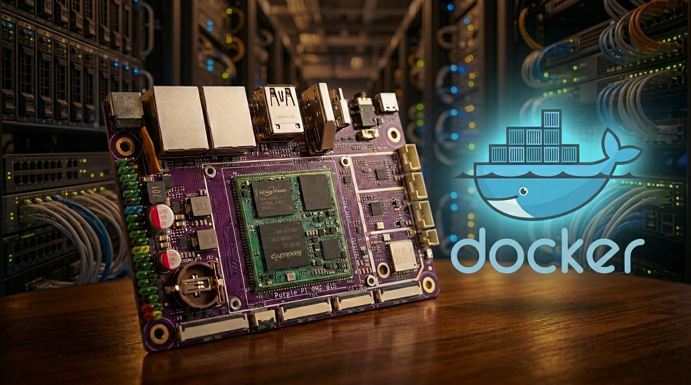
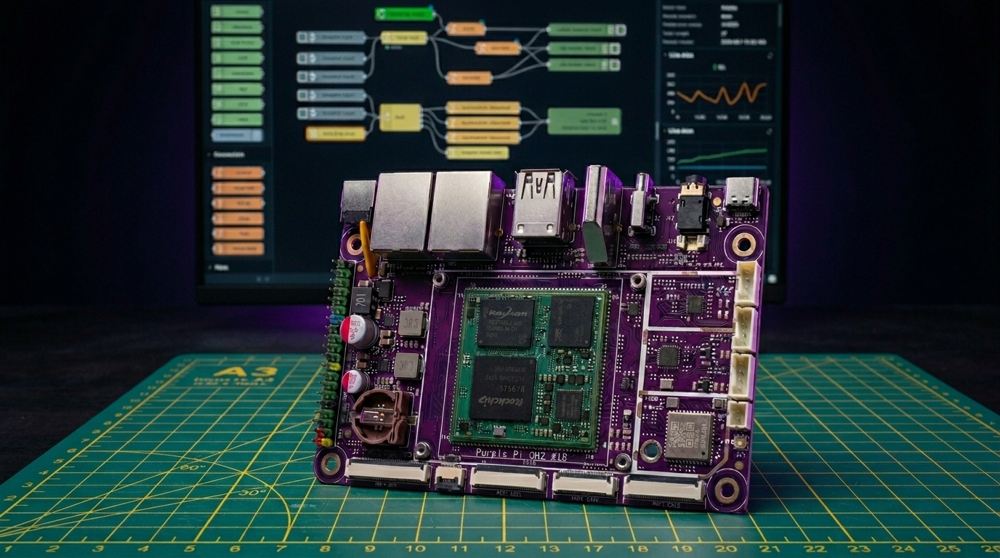
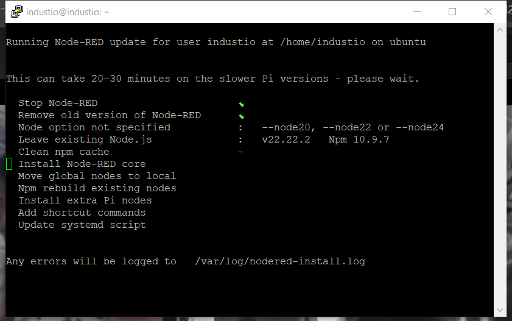
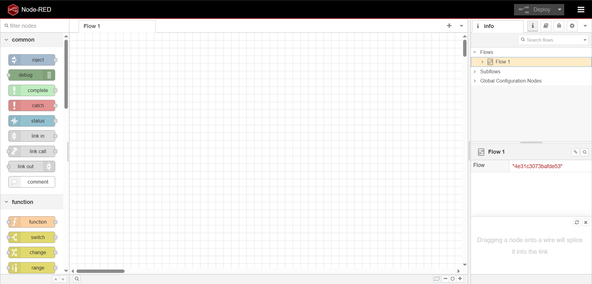
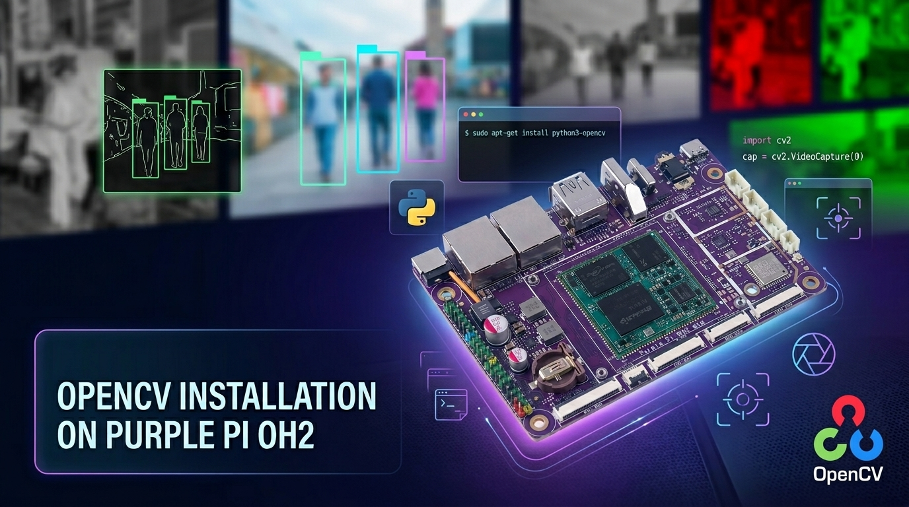
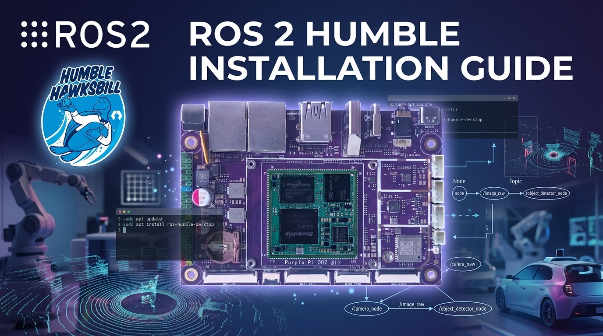
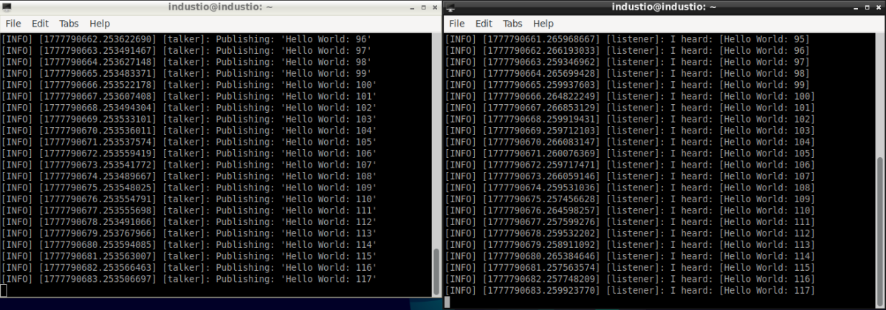
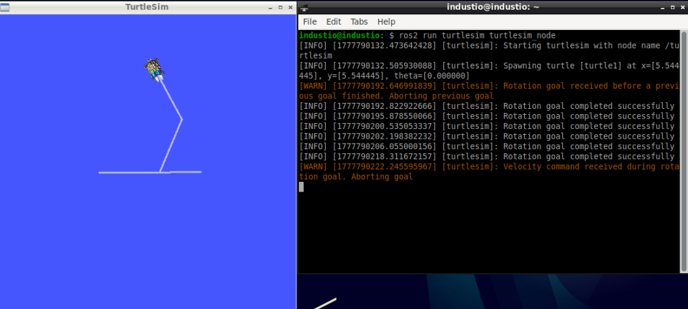
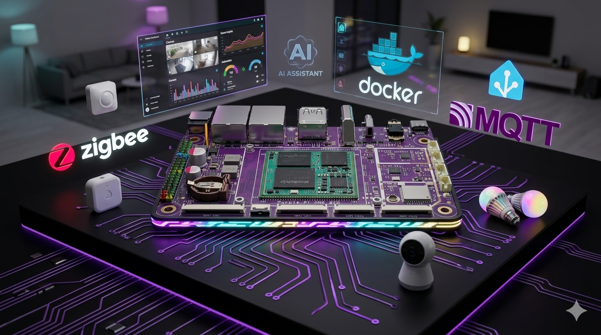
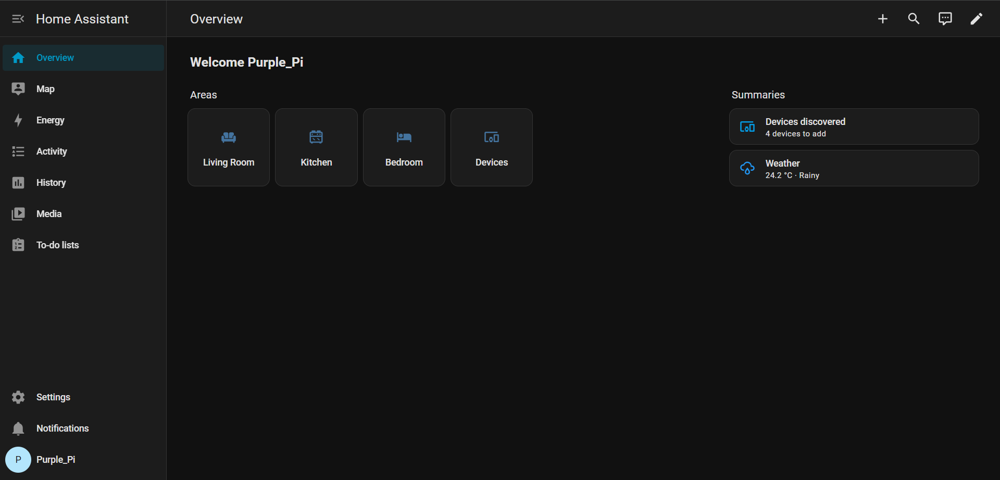

# Applications

<span class="badge badge-blue">Purple Pi OH2</span>&nbsp;
<span class="badge badge-blue">Docker</span>&nbsp;
<span class="badge badge-blue">Node-RED</span>&nbsp;
<span class="badge badge-orange">Home Assistant</span>

> This section focuses on learning essential tools such as Docker, Home Assistant, Node-RED, and OpenCV on the Purple Pi OH2. These technologies enable you to build, deploy, and manage smart applications ranging from IoT automation to computer vision systems. By setting up containerized environments, visual programming flows, home automation platforms, and image processing capabilities, the Purple Pi becomes a powerful edge computing device for real-world industrial and smart system applications.

---

## Docker Setup on Purple Pi OH2

### Overview



Docker is a platform that allows you to run applications in lightweight containers. On the Purple Pi OH2, Docker helps you deploy and manage applications efficiently without worrying about system dependencies.

---

### Install Docker

**Update Package List**

```bash
sudo apt-get update
```

---

**Install Docker**

```bash
sudo apt install docker.io
```

---

**Verify Installation**

```bash
docker -v
```

You should see the installed Docker version.

---

### Configure Docker

**Edit Docker Daemon Configuration (Optional)**

```bash
sudo nano /etc/docker/daemon.json
```

---

**Restart Docker Service**

```bash
sudo systemctl restart docker
```

---

### Run Docker Without sudo

**Add User to Docker Group**

```bash
sudo usermod -aG docker $USER
```

**Apply Group Changes**

```bash
newgrp docker
```

---

### Re-login

* Exit all SSH sessions
* Close terminals
* Log out and log back in

---

### Test Docker Installation

**Run Test Container**

```bash
docker run hello-world
```

**Expected Output**

* Docker pulls the `hello-world` image
* A confirmation message is displayed

---

## Node-RED Installation

### Overview



Node-RED is a flow-based development tool for visual programming, widely used in IoT and industrial applications. On the Purple Pi OH2, it allows you to connect hardware devices, APIs, and online services using a browser-based editor.

---

### Install Node-RED (All-in-One Script)

The Node-RED team provides an official installation script that installs:

* Node.js
* Node-RED
* Required dependencies

**Run Installation Script**

```bash
bash <(curl -sL https://raw.githubusercontent.com/node-red/linux-installers/master/deb/update-nodejs-and-nodered)
```

> This process may take some time depending on your internet speed.

---



### Installation Prompts (Recommended Settings)

During installation, you will be asked several questions. Use the following answers:

* **Node-RED settings file initialization** → Press `Enter` (default)
* **Share anonymous usage information** → `No`
* **User security** → `No` *(can enable later)*
* **Projects feature** → `No`
* **Flow file** → `flows.json` (press `Enter`)
* **Encrypt credentials file** → Press `Enter` (skip)
* **Editor theme/style** → Default
* **Text editor component** → `Monaco`
* **Allow external modules in function nodes** → `Yes`

---

### Node-RED Control Commands

After installation, use the following commands to manage Node-RED:

Use `node-red-start` to start Node-RED

Use `node-red-stop` to stop Node-RED

Use `node-red-restart` to start Node-RED again

Use `node-red-log` to view the recent log output

Use `sudo systemctl enable nodered.service` to enable auto-start at boot

Use `sudo systemctl disable nodered.service` to disable auto-start at boot

---

### Access Node-RED Editor

**Open in Web Browser**

If you are using the Purple Pi locally:

```text
http://localhost:1880
```

If accessing from another computer on the same network:

```text
http://{Purple_Pi_OH2_IP_ADDRESS}:1880
```

> Replace `{Purple_Pi_OH2_IP_ADDRESS}` with your device IP (e.g., `192.168.1.100`)





## OpenCV Installation

### Overview



OpenCV (Open Source Computer Vision Library) is used for image processing, video analysis, and AI-based vision applications.
On the **Purple Pi OH2**, OpenCV enables building powerful computer vision and edge AI solutions.

---

### Update System

```bash
sudo apt update
```

---

### Install Python libraries and basic tools, Codec Support, GStreamer Support, OpenCV:

```bash
sudo apt install python3-pil python3-numpy python3-pip git wget at-spi2-core
sudo apt install libavcodec-dev libavformat-dev libswscale-dev
sudo apt install libgstreamer-plugins-base1.0-dev libgstreamer1.0-dev
sudo apt install python3-opencv libopencv-dev
sudo apt install python3-opencv libopencv-dev
```


---

### Verify Installation

```bash
python3 -c "import cv2; print(cv2.__version__)"
```

**Expected Output**

* Displays installed OpenCV version (e.g., `4.x.x`)
* No errors should appear


## ROS 2 Installation on Purple Pi OH2

### Overview



ROS 2 (Robot Operating System 2) is a flexible framework for building robotics and automation applications.
On the **Purple Pi OH2**, ROS 2 enables development of robotic systems, sensor integration, and real-time communication.

---

### Set Up Locale

```bash
sudo apt update && sudo apt install locales
sudo locale-gen en_US en_US.UTF-8
sudo update-locale LC_ALL=en_US.UTF-8 LANG=en_US.UTF-8
export LANG=en_US.UTF-8
```

---

### Add ROS 2 Repository

**Install Required Tools**

```bash
sudo apt install software-properties-common
sudo add-apt-repository universe
sudo apt update && sudo apt install curl -y
```

---

**Add ROS 2 GPG Key**

```bash
sudo curl -sSL https://raw.githubusercontent.com/ros/rosdistro/master/ros.key -o /usr/share/keyrings/ros-archive-keyring.gpg
```

---

**Add Repository to Source List**

```bash
echo "deb [arch=$(dpkg --print-architecture) signed-by=/usr/share/keyrings/ros-archive-keyring.gpg] http://packages.ros.org/ros2/ubuntu $(. /etc/os-release && echo $UBUNTU_CODENAME) main" | sudo tee /etc/apt/sources.list.d/ros2.list > /dev/null
```

---

### Install ROS 2 Humble

**Update System**

```bash
sudo apt update
sudo apt upgrade
```

---

**Install Desktop Version**

```bash
sudo apt install ros-humble-desktop
```

---

**Install Development Tools**

```bash
sudo apt install ros-dev-tools
```

---

### Set Up Environment

```bash
echo "source /opt/ros/humble/setup.bash" >> ~/.bashrc
source ~/.bashrc
```

---

### Verify Installation

**Terminal 1**

```bash
ros2 run demo_nodes_cpp talker
```

---

**Terminal 2**

```bash
ros2 run demo_nodes_py listener
```

> You should see messages being published and received between nodes.



---

### Run Simulation (Turtlesim)

**Start Simulator**

```bash
ros2 run turtlesim turtlesim_node
```

---

**Control the Turtle**

```bash
ros2 run turtlesim turtle_teleop_key
```

> Use your keyboard to move the turtle in the simulation window.


---

## Home Assistant Docker Installation Guide

### What is Home Assistant?



Home Assistant is an open-source home automation platform that runs on a local network and allows you to control smart devices, automate routines, and monitor your home from a single dashboard.

### Verify Docker is Working

**Check Docker version**
```bash
docker -v
```

**Check Docker service status**
```bash
sudo systemctl status docker
```

**Run the hello-world test**
```bash
docker run hello-world
```

**Check architecture**
```bash
dpkg --print-architecture
```

### Install Home Assistant Container

**Create required directories**
```bash
sudo mkdir -p /opt/homeassistant/config
sudo mkdir -p /opt/homeassistant/localtime
```

**Set permissions**
```bash
sudo chmod -R 777 /opt/homeassistant
```

**Run Home Assistant Container (Docker)**
```bash
docker run -d \
  --name homeassistant \
  --privileged \
  --restart=unless-stopped \
  -e TZ=Asia/Shanghai \
  -v /opt/homeassistant/config:/config \
  -v /run/dbus:/run/dbus:ro \
  --network=host \
  ghcr.io/home-assistant/home-assistant:stable
```

| Parameter                              | Meaning                                          |
| -------------------------------------- | ------------------------------------------------ |
| `-d`                                   | Run in background                                |
| `--name homeassistant`                 | Container name                                   |
| `--privileged`                         | Full hardware access (required for USB/Zigbee)   |
| `--restart=unless-stopped`             | Auto-restart on boot                             |
| `-e TZ=Asia/Shanghai`                  | Set timezone (change to yours)                   |
| `-v /opt/homeassistant/config:/config` | Store config on host                             |
| `--network=host`                       | Use host network (required for device discovery) |

**Verify Home Assistant is running**
```bash
docker ps
```

**Access Home Assistant**

Open browser and go to:

`http://<your-purple-pi-ip>:8123`

You will be able to see the welcome page. After completing the setup wizard with your username and password, you can access the dashboard page.



### Manage Home Assistant Container

| Command                                                    | Action                          |
| ---------------------------------------------------------- | ------------------------------- |
| `docker stop homeassistant`                                | Stop HA                         |
| `docker start homeassistant`                               | Start HA                        |
| `docker restart homeassistant`                             | Restart HA                      |
| `docker logs homeassistant`                                | View logs                       |
| `docker rm -f homeassistant`                               | Remove container (config stays) |
| `docker pull ghcr.io/home-assistant/home-assistant:stable` | Update HA image                 |

### How to Update Home Assistant

```bash
docker stop homeassistant
docker rm homeassistant
docker pull ghcr.io/home-assistant/home-assistant:stable
```

Then run the Docker `run` command from above again.


