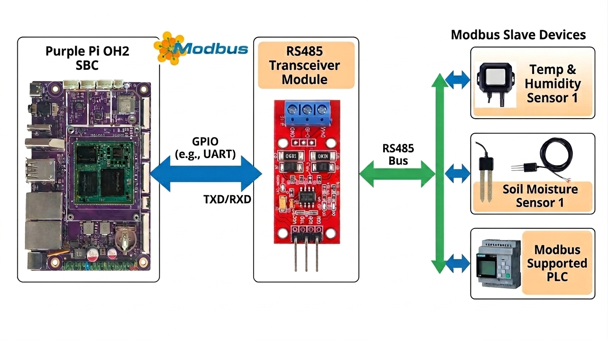
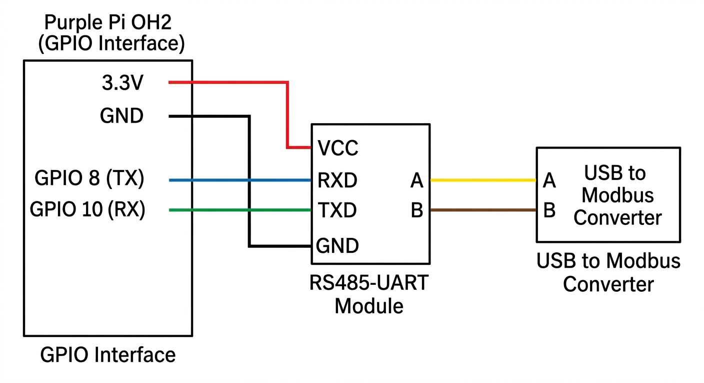
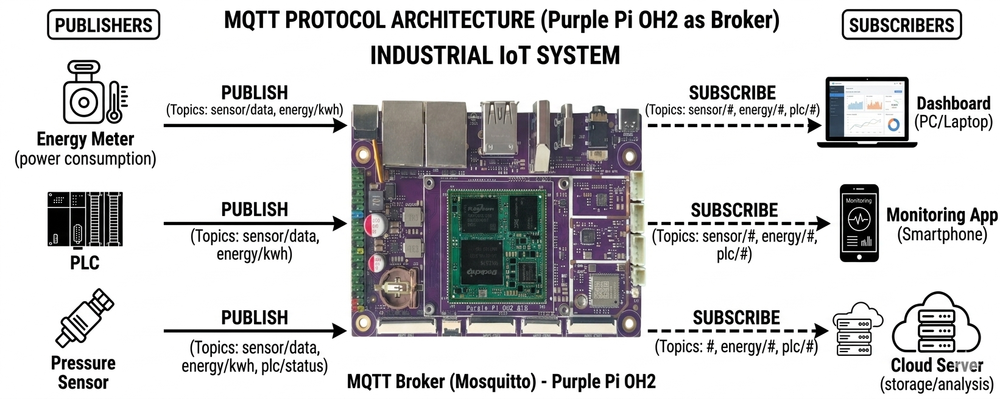
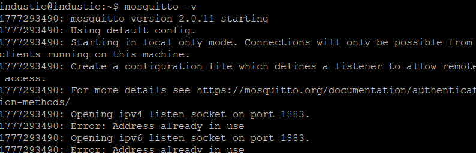
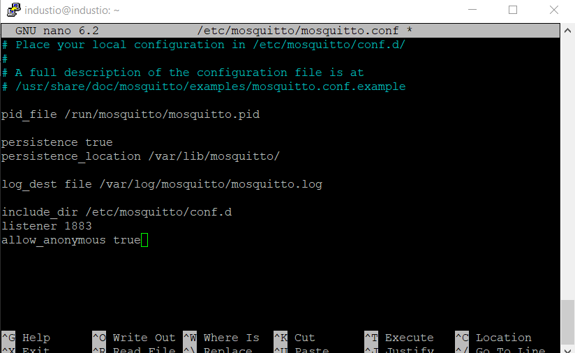
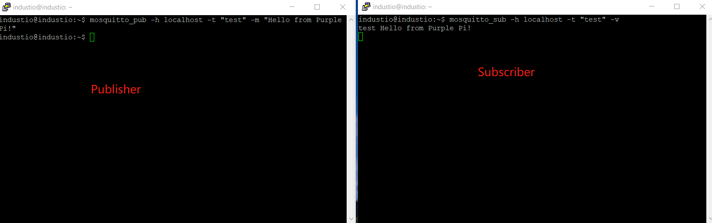

# Industrial Protocols 

<span class="badge badge-blue">Purple Pi OH2</span>&nbsp;
<span class="badge badge-blue">Modbus</span>&nbsp;
<span class="badge badge-blue">MQTT</span>&nbsp;
<span class="badge badge-blue">CANbus</span></span>


> Learning industrial communication protocols such as CAN Bus, Modbus, and MQTT on the Purple Pi enables reliable integration between embedded devices, industrial equipment, and cloud systems. By configuring interfaces like UART, SPI, and network services, the Purple Pi can act as a bridge between field-level devices and higher-level applications. Mastering these protocols provides a strong foundation for building scalable IoT and industrial automation solutions.

## Modbus RTU with Purple Pi OH2



### Overview of Modbus RTU

Modbus RTU is a widely used serial communication protocol in industrial automation systems. It enables reliable communication between controllers, sensors, actuators, and other field devices over simple physical layers such as RS-485. Its simplicity, robustness, and vendor-neutral design make it a standard choice in industrial environments.

### Why Modbus RTU

Modbus RTU is designed for deterministic and reliable communication in noisy industrial environments. It operates over RS-485, which supports long cable distances and multi-drop configurations. Due to its simplicity and low overhead, it is efficient for real-time control and monitoring applications.

### Connecting Purple Pi OH2 to Modbus RTU

The Purple Pi OH2 can communicate with Modbus RTU devices using its UART interface combined with an RS-485 transceiver module. Since Modbus RTU commonly runs over RS-485, a UART-to-RS485 converter is required to bridge the hardware interface.

### Prerequisites

* Purple Pi OH2 board
* UART to RS-485 converter module (MAX13487E recommended)
* RS-485 to USB adapter (for testing with PC)
* Modbus Slave software: [https://www.modbustools.com/download.html](https://www.modbustools.com/download.html)
* Python 3 environment
* Basic understanding of serial communication

### Hardware Components

* RS485-UART Converter Board based on MAX13487E
* USB to RS485 converter for PC-side simulation/testing

### Connection Overview



Connect the RS485-UART converter to the Purple Pi OH2 GPIO UART pins as follows:

```
GPIO 8   ----> RX  
GPIO 10  ----> TX  
3.3V     ----> VCC  
GND      ----> GND  
```

For RS-485 bus wiring:

```
A ----> A  
B ----> B  
```

Ensure correct polarity; reversing A and B will prevent communication.

### Modbus Slave Software Configuration

1. Install and open Modbus Slave software on your PC
2. Select the correct COM port (connected via RS485-USB adapter)
3. Configure serial settings:

   * Baud rate: 115200
   * Data bits: 8
   * Parity: None
   * Stop bits: 1 (8N1)
4. Set the slave ID (e.g., 1)
5. Configure holding registers for testing

### Software Setup on Purple Pi OH2

#### Create Project Directory

```bash
mkdir Purple_pi_modbus
cd Purple_pi_modbus
```

#### Create and Activate Virtual Environment

```bash
python3 -m venv venv
source venv/bin/activate
```

#### Install Required Libraries

```bash
pip install pyserial minimalmodbus
```

### Modbus RTU Test Script

Create a file named `modbus_server_purplepi.py`:

```python
#!/usr/bin/env python3
import minimalmodbus
import serial
import time

# --- Configuration ---
PORT = '/dev/ttyS7'
SLAVE_ADDRESS = 1
BAUDRATE = 115200
BYTESIZE = 8
PARITY = serial.PARITY_NONE
STOPBITS = 1
TIMEOUT = 0.5

# --- Register to Read ---
REGISTER_ADDRESS = 0
NUMBER_OF_REGISTERS = 1
FUNCTION_CODE = 3

# --- Create instrument object ---
try:
    instrument = minimalmodbus.Instrument(PORT, SLAVE_ADDRESS)
    instrument.serial.baudrate = BAUDRATE
    instrument.serial.bytesize = BYTESIZE
    instrument.serial.parity = PARITY
    instrument.serial.stopbits = STOPBITS
    instrument.serial.timeout = TIMEOUT
    instrument.mode = minimalmodbus.MODE_RTU
    instrument.clear_buffers_before_each_transaction = True

    print(f"Attempting to communicate with Modbus slave ID {SLAVE_ADDRESS} on {PORT}...")
    print(f"Serial settings: {BAUDRATE} baud, {BYTESIZE}{PARITY}{STOPBITS}")
    print("-" * 40)

except Exception as e:
    print(f"Error setting up serial port: {e}")
    exit(1)

# --- Test Communication ---
try:
    print("Reading holding registers...")
    values = instrument.read_registers(
        registeraddress=REGISTER_ADDRESS,
        number_of_registers=NUMBER_OF_REGISTERS,
        functioncode=FUNCTION_CODE
    )

    print(f"Successfully read {NUMBER_OF_REGISTERS} register(s) starting at address {REGISTER_ADDRESS}:")
    for i, val in enumerate(values):
        print(f"  Register {REGISTER_ADDRESS + i}: {val} (0x{val:04X})")

except minimalmodbus.NoResponseError:
    print(f"ERROR: No response from device {SLAVE_ADDRESS}.")
    print("Check:")
    print(f"  - Is the device powered and connected to {PORT}?")
    print(f"  - Is the slave address correct?")
    print(f"  - Are the baud rate and serial settings correct?")
    print("  - Is the register address valid and readable?")

except minimalmodbus.InvalidResponseError as e:
    print("ERROR: Invalid response received.")
    print(f"Details: {e}")

except Exception as e:
    print(f"Unexpected error: {e}")

finally:
    if instrument.serial:
        instrument.serial.close()
        print("Serial port closed.")
```

### Permissions Setup

Add your user to the `dialout` group to access serial ports:

```bash
sudo usermod -a -G dialout $USER
```

After running this command:

* Close all terminals and VS Code
* Log out and log back in (or reboot)

### Running the Application

Reactivate your virtual environment:

```bash
cd Purple_pi_modbus
source venv/bin/activate
```

Run the script:

```bash
python3 modbus_server_purplepi.py
```

### Notes and Troubleshooting

* Ensure `/dev/ttyS7` matches your actual UART device
* Verify wiring, especially A/B polarity
* Confirm baud rate and slave ID match the Modbus Slave software
* Use proper grounding to avoid noise-related errors
* Enable debug mode in `minimalmodbus` if deeper inspection is needed

### Conclusion

This setup demonstrates a basic Modbus RTU master implementation using the Purple Pi OH2. It can be extended to interact with PLCs, industrial sensors, and other Modbus-compatible devices for real-world automation applications.

---

## MQTT Basics and Setup Guide

### What is MQTT?

MQTT (Message Queuing Telemetry Transport) is a lightweight messaging protocol designed for communication between devices, especially in IoT systems. It uses a publish–subscribe model, making it efficient for low-bandwidth and unreliable networks.

---

### Advantages of MQTT

* **Lightweight protocol** – Uses minimal bandwidth, making it ideal for IoT and embedded devices.
* **Efficient communication** – Publish/subscribe model reduces direct device-to-device communication overhead.
* **Reliable message delivery** – Supports different Quality of Service (QoS) levels for message assurance.

---

### MQTT Components

#### Client

A client is any device or application that sends (publishes) or receives (subscribes to) messages in the MQTT system.

#### Connection

A connection is the network link established between a client and the broker using TCP/IP.

#### Broker

The broker is the central server that receives messages from publishers and distributes them to subscribers based on topics.

---

### How MQTT Works



MQTT works using a publish–subscribe communication model where clients do not communicate directly with each other. A publisher sends a message to a specific topic on the broker. The broker then forwards that message to all clients subscribed to that topic. This decouples devices, making the system scalable and efficient.

---

### Setting Up Purple Pi OH2 as an MQTT Broker

**Step 1: Install Mosquitto**

```bash
sudo apt update
sudo apt install -y mosquitto mosquitto-clients
```

---

**Step 2: Enable Mosquitto Service**

```bash
sudo systemctl enable mosquitto.service
```

---

**Step 3: Run Mosquitto Broker**

```bash
mosquitto -v
```

---

### Enable Remote Access (No Authentication)

**Step 4: Edit Configuration File**

```bash
sudo nano /etc/mosquitto/mosquitto.conf
```

**Add the following at the end of the file:**

```conf
listener 1883
allow_anonymous true
```


**Save and exit:**

* Press `CTRL + X`
* Press `Y`
* Press `Enter`

---

**Step 5: Restart Mosquitto**

```bash
sudo systemctl restart mosquitto
```

---

### Testing MQTT Communication

**Terminal 1 (Subscriber)**

```bash
mosquitto_sub -h localhost -t "test" -v
```

---

**Terminal 2 (Publisher)**

```bash
mosquitto_pub -h localhost -t "test" -m "Hello from Purple Pi!"
```

---

#### Expected Result

The message published from Terminal 2 should appear in Terminal 1.


---

### Notes

* Port `1883` is the default MQTT port.
* `allow_anonymous true` is useful for testing but **not recommended for production** due to security risks.
