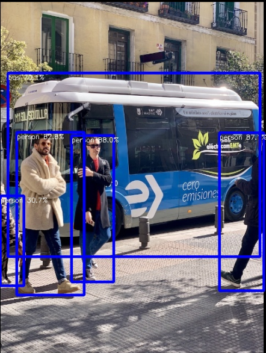

# NPU Usage

<span class="badge badge-blue">Purple Pi OH2</span>&nbsp;
<span class="badge badge-blue">Yolo</span>&nbsp;
<span class="badge badge-blue">LLM</span>&nbsp;
<span class="badge badge-blue">AI</span>&nbsp;
<span class="badge badge-orange">NPU</span>

>The Purple Pi OH2 is equipped with a powerful Neural Processing Unit (NPU) designed to accelerate AI workloads efficiently at the edge. In this section, we explore how to utilize the NPU using RKNN and RLLM frameworks to run real-world AI applications. This includes vision-based tasks such as object detection, as well as Large Language Model (LLM) inference and voice AI processing. By leveraging the NPU, you can achieve faster performance, lower latency, and energy-efficient AI execution for embedded, industrial, and smart system applications.


---

## Vision (NPU + YOLOv5) 

### Overview

This guide demonstrates how to verify the NPU (Neural Processing Unit) on the Purple Pi OH2 and run a YOLOv5 object detection demo using the RKNN Toolkit.

---

### Check Your NPU is Ready

Open a terminal and run the following commands:

```bash
# 1. Check NPU driver is loaded
dmesg | grep -i npu

# 2. Check NPU device exists
ls -la /dev/dri/

# 3. Check RKNN runtime library exists
ls -l /usr/lib/librknnrt.so
```

**Expected Output**

* Lines showing `RKNPU` and driver information
* Devices like `renderD128` and `renderD129`
* File `/usr/lib/librknnrt.so` exists

> ✅ If all checks pass, your NPU is ready!

---

### Install Required Packages

```bash
sudo apt update
sudo apt install -y build-essential cmake git
```

> These tools are required for compiling the demo.

---

### Download RKNN Toolkit

```bash
mkdir -p ~/Downloads
cd ~/Downloads

git clone https://github.com/airockchip/rknn-toolkit2.git
```

---

### Navigate to YOLOv5 Demo

```bash
cd ~/Downloads/rknn-toolkit2/rknpu2/examples/rknn_yolov5_demo
```

Check contents:

```bash
ls
```

You should see:

* `build-linux.sh`
* `model/`
* `src/`

---

### Set Up Compiler

```bash
export GCC_COMPILER=/usr/bin/aarch64-linux-gnu
```

---

### Build the Demo

```bash
chmod +x build-linux.sh
./build-linux.sh -t rk3576 -a aarch64 -b Release
```

**Build Options Explained**

* `-t rk3576` → Chip type
* `-a aarch64` → Architecture
* `-b Release` → Optimized build

> ⚠️ Ignore minor warnings or video demo errors.

---

### Locate Compiled Binary

```bash
find ~/Downloads/rknn-toolkit2/rknpu2/examples/rknn_yolov5_demo -name "rknn_yolov5_demo" -type f
```

---

### Navigate to Build Directory

```bash
cd ~/Downloads/rknn-toolkit2/rknpu2/examples/rknn_yolov5_demo/build/build_RK3576_linux_aarch64_Release
```

Verify:

```bash
ls
```

You should see:

* `rknn_yolov5_demo`

---

### Prepare Labels File

```bash
mkdir -p model
cp ../../model/coco_80_labels_list.txt model/
```

---

### Make Executable

```bash
chmod +x rknn_yolov5_demo
```

---

### Run YOLOv5 Detection

```bash
./rknn_yolov5_demo ../../model/RK3576/yolov5s-640-640.rknn ../../model/bus.jpg
```

---

### Expected Output

Example:

```
Loading mode...
once run use 30.298000 ms
person @ (209 243 286 510) 0.879723
person @ (479 238 560 526) 0.870588
bus @ (93 129 553 464) 0.700761
save detect result to ./out.jpg
```

---
