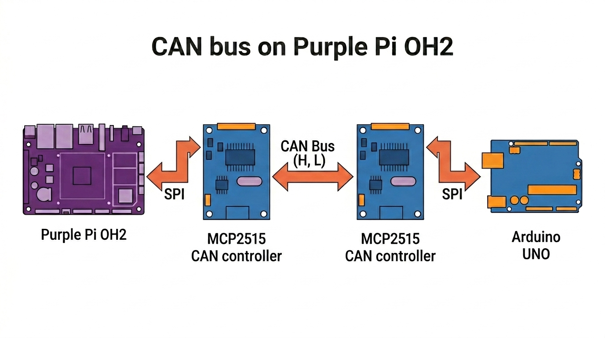

# 💡 GPIO Usage

<span class="badge badge-blue">Purple Pi OH2</span>&nbsp;
<span class="badge badge-blue">DI-DO</span>&nbsp;
<span class="badge badge-blue">I2C</span>&nbsp;
<span class="badge badge-blue">SPI</span>&nbsp;
<span class="badge badge-orange">Python · gpiod</span>

> Control a GPIO pin from Python to switch an LED on and off — a practical starting point for any digital output application (relays, buzzers, indicators).

---

## Connect via SSH (VS Code)

1. Install the **Remote - SSH** extension in VS Code
2. Press `F1` → **Remote-SSH: Connect to Host**
3. Enter: `ssh industio@<your_device_ip>`

---

## GPIO Map

| Pin # | Function     | Description / Alternate Functions           | Voltage / Type | Device Node / Notes        |
|------:|-------------|--------------------------------------------|----------------|----------------------------|
| 1     | 3.3V        | Power supply output                        | 3.3V DC        | Power output               |
| 2     | 5V          | Power supply output                        | 5V DC          | Power output               |
| 3     | I2C4_SDA    | I2C4 data signal                           | 3.3V logic     | /dev/i2c-4                 |
| 4     | 5V          | Power supply output                        | 5V DC          | Power output               |
| 5     | I2C4_SCL    | I2C4 clock signal                          | 3.3V logic     | /dev/i2c-4                 |
| 6     | GND         | Ground                                     | 0V             | Reference ground           |
| 7     | GPIO76      | GPIO2_B4 - General purpose I/O             | 3.3V logic     | gpiochip2 offset 12        |
| 8     | UART7_TX    | UART7 transmit data                        | TTL 3.3V       | /dev/ttyS7                 |
| 9     | GND         | Ground                                     | 0V             | Reference ground           |
| 10    | UART7_RX    | UART7 receive data                         | TTL 3.3V       | /dev/ttyS7                 |
| 11    | GPIO75      | GPIO2_B3 - General purpose I/O             | 3.3V logic     | gpiochip2 offset 11        |
| 12    | GPIO77      | GPIO2_B5 - General purpose I/O             | 3.3V logic     | gpiochip2 offset 13        |
| 13    | GPIO72      | GPIO2_B0 - General purpose I/O             | 3.3V logic     | gpiochip2 offset 8         |
| 14    | GND         | Ground                                     | 0V             | Reference ground           |
| 15    | GPIO73      | GPIO2_B1 - General purpose I/O             | 3.3V logic     | gpiochip2 offset 9         |
| 16    | GPIO74      | GPIO2_B2 - General purpose I/O             | 3.3V logic     | gpiochip2 offset 10        |
| 17    | 3.3V        | Power supply output                        | 3.3V DC        | Power output               |
| 18    | GPIO136     | GPIO4_B0 - General purpose I/O             | 3.3V logic     | gpiochip4 offset 8         |
| 19    | SPI0_MOSI   | SPI0 master output, slave input            | 3.3V logic     | /dev/spidev0.0             |
| 20    | GND         | Ground                                     | 0V             | Reference ground           |
| 21    | SPI0_MISO   | SPI0 master input, slave output            | 3.3V logic     | /dev/spidev0.0             |
| 22    | GPIO137     | GPIO4_B1 - General purpose I/O             | 3.3V logic     | gpiochip4 offset 9         |
| 23    | SPI0_SCLK   | SPI0 serial clock                          | 3.3V logic     | /dev/spidev0.0             |
| 24    | SPI0_CS0    | SPI0 chip select 0                         | 3.3V logic     | /dev/spidev0.0             |
| 25    | GND         | Ground                                     | 0V             | Reference ground           |
| 26    | SPI0_CS1    | SPI0 chip select 1                         | 3.3V logic     | /dev/spidev0.1             |
| 27    | I2C7_SDA    | I2C7 data signal                           | 3.3V logic     | /dev/i2c-7                 |
| 28    | I2C7_SCL    | I2C7 clock signal                          | 3.3V logic     | /dev/i2c-7                 |
| 29    | GPIO56      | GPIO1_D0 - General purpose I/O             | 3.3V logic     | gpiochip1 offset 24        |
| 30    | GND         | Ground                                     | 0V             | Reference ground           |
| 31    | GPIO57      | GPIO1_D1 - General purpose I/O             | 3.3V logic     | gpiochip1 offset 25        |
| 32    | GPIO132     | GPIO4_A4 - General purpose I/O             | 3.3V logic     | gpiochip4 offset 4         |
| 33    | GPIO58      | GPIO1_D2 - General purpose I/O             | 3.3V logic     | gpiochip1 offset 26        |
| 34    | GND         | Ground                                     | 0V             | Reference ground           |
| 35    | GPIO59      | GPIO1_D3 - General purpose I/O             | 3.3V logic     | gpiochip1 offset 27        |
| 36    | GPIO134     | GPIO4_A6 - General purpose I/O             | 3.3V logic     | gpiochip4 offset 6         |
| 37    | POWER_KEY   | Power key input (system power control)     | 3.3V logic     | /dev/input/event0          |
| 38    | GPIO98      | GPIO3_A2 - General purpose I/O             | 3.3V logic     | gpiochip3 offset 2         |
| 39    | GND         | Ground                                     | 0V             | Reference ground           |
| 40    | GPIO99      | GPIO3_A3 - General purpose I/O             | 3.3V logic     | gpiochip3 offset 3         |


## Project Setup

=== "Create folder & virtual environment"

    ```bash
    mkdir my_project && cd my_project

    sudo apt update
    sudo apt install python3-venv python3-libgpiod libgpiod-dev gpiod -y

    python3 -m venv venv
    source venv/bin/activate
    ```

    Your prompt should change to:
    ```
    (venv) industio@device:~/my_project$
    ```

=== "Create the script file"

    ```bash
    touch led_controller.py
    ```

---
## Digital Output 

### Hardware Wiring


```
Pin 40 (GPIO3_A3)  →  [220Ω resistor]  →  LED (+)
GND (Pin 39)       →  LED (–)
```

!!! warning "Always use a resistor"
    A 220Ω resistor protects both the LED and the GPIO pin from overcurrent. Skipping it can permanently damage the pin.

---

### Install gpiod

First, install the required gpiod package:

```bash
pip install gpiod
```

---

### Set GPIO Permissions

Grant permissions to access GPIO devices:

```bash
sudo chmod 666 /dev/gpiochip*
```

---

### LED Control Scripts

=== "Single blink - digital_output.py"

    ```python
    #!/usr/bin/env python3
    """
    Simple LED On/Off for Purple Pi OH2
    Using /dev/gpiochip3, line 3
    """

    import gpiod
    import time
    from gpiod.line import Direction, Value

    # Your specific GPIO pin
    CHIP = '/dev/gpiochip3'
    LINE = 3

    def led_on():
        """Turn LED on"""
        with gpiod.request_lines(
            CHIP,
            consumer="led_control",
            config={
                LINE: gpiod.LineSettings(
                    direction=Direction.OUTPUT,
                    output_value=Value.ACTIVE,
                )
            },
        ) as request:
            request.set_value(LINE, Value.ACTIVE)
            print("LED is ON")

    def led_off():
        """Turn LED off"""
        with gpiod.request_lines(
            CHIP,
            consumer="led_control",
            config={
                LINE: gpiod.LineSettings(
                    direction=Direction.OUTPUT,
                    output_value=Value.INACTIVE,
                )
            },
        ) as request:
            request.set_value(LINE, Value.INACTIVE)
            print("LED is OFF")

    def main():
        print("Simple LED Controller - GPIO3 Line 3\n")
        
        # Turn LED on
        led_on()
        
        # Wait 2 seconds
        time.sleep(2)
        
        # Turn LED off
        led_off()

    if __name__ == "__main__":
        main()
    ```

=== "Continuous blink - blink.py"

    ```python
    #!/usr/bin/env python3
    """
    Continuous LED Blinking for Purple Pi OH2
    Using /dev/gpiochip3, line 3
    Press Ctrl+C to stop
    """

    import gpiod
    import time
    import signal
    import sys
    from gpiod.line import Direction, Value

    # Your specific GPIO pin
    CHIP = '/dev/gpiochip3'
    LINE = 3

    # Global variable to control blinking
    blinking = True

    def signal_handler(sig, frame):
        """Handle Ctrl+C gracefully"""
        global blinking
        print("\n\nStopping blinking...")
        blinking = False
        # Turn LED off before exiting
        try:
            with gpiod.request_lines(
                CHIP,
                consumer="led_control",
                config={
                    LINE: gpiod.LineSettings(
                        direction=Direction.OUTPUT,
                        output_value=Value.INACTIVE,
                    )
                },
            ) as request:
                request.set_value(LINE, Value.INACTIVE)
                print("LED turned off")
        except:
            pass
        sys.exit(0)

    def continuous_blink(interval=0.5):
        """Blink LED continuously until Ctrl+C is pressed"""
        global blinking
        
        # Register signal handler for Ctrl+C
        signal.signal(signal.SIGINT, signal_handler)
        
        print("Continuous Blinking Mode - GPIO3 Line 3")
        print("Press Ctrl+C to stop\n")
        
        try:
            with gpiod.request_lines(
                CHIP,
                consumer="led_blink",
                config={
                    LINE: gpiod.LineSettings(
                        direction=Direction.OUTPUT,
                        output_value=Value.INACTIVE,
                    )
                },
            ) as request:
                
                while blinking:
                    # LED ON
                    request.set_value(LINE, Value.ACTIVE)
                    print("LED ON")
                    time.sleep(interval)
                    
                    # LED OFF
                    request.set_value(LINE, Value.INACTIVE)
                    print("LED OFF")
                    time.sleep(interval)
                    
        except Exception as e:
            print(f"Error: {e}")

    def main():
        # Start continuous blinking with 0.5 second intervals
        continuous_blink(interval=0.5)
        
        # Keep the program running
        while True:
            time.sleep(0.1)

    if __name__ == "__main__":
        main()
    ```

---

### Run the Script

!!! warning "Permissions required"
    GPIO access requires proper permissions. Make sure you've run the permission command above.

```bash
python3 digital_output.py
```

Or for continuous blinking:

```bash
python3 blink.py
```

Stop the blink loop at any time with `Ctrl + C`.

---

### Manual GPIO Testing (no Python)

Useful for quickly verifying your wiring before running a script:

```bash
gpioinfo                    # List all chips and offsets
gpioset gpiochip3 3=1       # Pin 40 HIGH → LED on
gpioset gpiochip3 3=0       # Pin 40 LOW  → LED off
gpioget gpiochip3 3         # Read current state
```

---

## Digital Input

### Input Monitor Script

Use this code for GPIO input state change detection on Purple Pi OH2:

```python
#!/usr/bin/env python3
"""
Simple GPIO Input with State Change Detection for Purple Pi OH2
Using /dev/gpiochip2, line 12
Press Ctrl+C to stop
"""

import gpiod
import time
from gpiod.line import Direction, Value, Bias, Edge

# Your specific GPIO input pin
CHIP = '/dev/gpiochip2'
LINE = 12

def detect_state_changes():
    """Detect and report state changes on GPIO input"""
    print(f"Monitoring GPIO input on {CHIP}, line {LINE}")
    print("Press Ctrl+C to stop\n")
    
    # Configure the GPIO line as input with pull-down
    config = {
        LINE: gpiod.LineSettings(
            direction=Direction.INPUT,
            bias=Bias.PULL_DOWN,  # Pull-down: LOW when nothing connected
            edge_detection=Edge.BOTH,  # Detect both rising and falling edges
        )
    }
    
    try:
        with gpiod.request_lines(
            CHIP,
            consumer="input_monitor",
            config=config,
        ) as request:
            
            previous_state = None
            
            while True:
                # Read current value
                current_value = request.get_value(LINE)
                
                # Check for state change
                if previous_state is not None and current_value != previous_state:
                    if current_value == Value.ACTIVE:
                        print("🔘 HIGH (Button PRESSED or signal HIGH)")
                    else:
                        print("🔘 LOW (Button RELEASED or signal LOW)")
                
                previous_state = current_value
                
                # Small delay to prevent CPU overuse
                time.sleep(0.01)
                
    except KeyboardInterrupt:
        print("\n\nMonitoring stopped")
    except Exception as e:
        print(f"Error: {e}")

def main():
    print("=" * 50)
    print("GPIO Input State Change Detector")
    print("=" * 50)
    detect_state_changes()

if __name__ == "__main__":
    main()
```

### Run the Script

Make sure GPIO permissions are granted before running the script:

```bash
sudo chmod 666 /dev/gpiochip*
python3 digital_input.py
```

---

## I2C OLED (SSD1306) Complete Guide

!!! warning "Disconnect power first"
    Remove power before connecting the SSD1306 OLED Display to avoid damaging the device.

---

###  Overview

This guide covers:

* Detecting I2C devices
* Communicating via Python
* Displaying text on OLED
* Rendering images + custom graphics

---

### Wiring (SSD1306 OLED)

| OLED Pin | Purple Pi |
| -------- | --------- |
| VCC      | 3.3V      |
| GND      | GND       |
| SDA      | Pin 3     |
| SCL      | Pin 5     |

#### Interpretation

| Item           | Value        |
| -------------- | ------------ |
| I2C Bus        | `/dev/i2c-4` |
| Device Address | `0x3C`       |
| Device Type    | SSD1306 OLED |

---

### Detect I2C Bus

#### List available I2C buses:

```bash
ls /dev/i2c-*
```

**Example output:**

```
/dev/i2c-0 ... /dev/i2c-7
```

---

### Scan for I2C Devices

!!! warning "Root permission required"
    Scanning I2C buses requires sudo access.

```bash
sudo i2cdetect -y 4
```

**Output:**

```
     0  1  2  3  4  5  6  7  8  9  a  b  c  d  e  f
00:                         -- -- -- -- -- -- -- -- 
10: -- -- -- -- -- -- -- -- -- -- -- -- -- -- -- -- 
20: -- -- -- -- -- -- -- -- -- -- -- -- -- -- -- -- 
30: -- -- -- -- -- -- -- -- -- -- 3c -- -- -- 
40: -- -- -- -- -- -- -- -- -- -- -- -- -- -- -- -- 
50: -- -- -- -- -- -- -- -- -- -- -- -- -- -- -- -- 
60: -- -- -- -- -- -- -- -- -- -- -- -- -- -- -- -- 
70: -- -- -- -- -- -- -- -- 
```

**Device found at:**

```
0x3C
```

---

### Install Required Packages

```bash
sudo apt update
sudo apt install i2c-tools -y
pip install python-periphery pillow
```

---

### Set I2C Permissions

Grant permissions to access I2C devices before running scripts:

```bash
sudo chmod 666 /dev/i2c-4
```

---

### Basic I2C Test

Create the `i2c_test.py` script:

```python
from periphery import I2C
import time

# Purple Pi OH2 Configuration
I2C_BUS = "/dev/i2c-4"  # Confirmed by your i2cdetect output
I2C_ADDR = 0x3C         # Confirmed by your scan

def main():
    try:
        # Open I2C connection
        i2c = I2C(I2C_BUS)
        print(f"Connected to {I2C_BUS}, device at {hex(I2C_ADDR)}")

        # SSD1306 Initialization Sequence
        init_sequence = [
            0xAE,  # Display off
            0x00, 0x10, 0x40, 0xB0, 0x81, 0xCF, 0xA1, 0xA6,
            0xA8, 0x3F, 0xC8, 0xD3, 0x00, 0xD5, 0x80, 0xD9,
            0xF1, 0xDA, 0x12, 0xDB, 0x40, 0x8D, 0x14, 0xAF  # Display on
        ]

        # Send initialization commands
        for cmd in init_sequence:
            i2c.transfer(I2C_ADDR, [I2C.Message([0x00, cmd])])
        time.sleep(0.1)

        # Clear display function
        def clear_display():
            for page in range(8):
                # Set page address
                i2c.transfer(I2C_ADDR, [I2C.Message([0x00, 0xB0 + page])])
                # Set column address
                i2c.transfer(I2C_ADDR, [I2C.Message([0x00, 0x00])])
                i2c.transfer(I2C_ADDR, [I2C.Message([0x00, 0x10])])
                # Write zeros to all columns
                for _ in range(128):
                    i2c.transfer(I2C_ADDR, [I2C.Message([0x40, 0x00])])

        clear_display()

        # Simple 5x7 font
        font = {
            'H': [0x7F, 0x08, 0x08, 0x08, 0x7F],
            'e': [0x38, 0x54, 0x54, 0x54, 0x18],
            'l': [0x00, 0x41, 0x7F, 0x40, 0x00],
            'o': [0x38, 0x44, 0x44, 0x44, 0x38],
            ' ': [0x00, 0x00, 0x00, 0x00, 0x00],
        }
        
        text = "Hello"

        # Position at page 1
        i2c.transfer(I2C_ADDR, [I2C.Message([0x00, 0xB1])])
        # Set column to 0
        i2c.transfer(I2C_ADDR, [I2C.Message([0x00, 0x00])])
        i2c.transfer(I2C_ADDR, [I2C.Message([0x00, 0x10])])

        # Write each character
        for char in text:
            char_data = font.get(char, [0x00]*5)
            for col in char_data:
                i2c.transfer(I2C_ADDR, [I2C.Message([0x40, col])])
            # Space between characters
            i2c.transfer(I2C_ADDR, [I2C.Message([0x40, 0x00])])

        print("Text sent successfully!")
        i2c.close()

    except Exception as e:
        print(f"Error: {e}")
        print("\nTroubleshooting:")
        print("1. Make sure you're using sudo: sudo python3 i2c_test.py")
        print("2. Check wiring: SDA=Pin3, SCL=Pin5, VCC=Pin1(3.3V), GND=Pin9")

if __name__ == "__main__":
    main()
```

#### Run the Test:

```bash
python3 i2c_test.py
```

**Expected Output:**

```
Connected to /dev/i2c-4, device at 0x3c
Text sent successfully!
```

---

## Display Image (Bitmap)

### Generate Bitmap

First, create a bitmap from your image. Place your graphics file in the project directory, then create `converter.py`:

```python
from PIL import Image

# Load image - replace with yours
img = Image.open("elephant.png").convert("L") 

# Resize smaller (leave space for text)
img = img.resize((128, 48))

# Convert to black/white
img = img.point(lambda x: 0 if x < 128 else 255, '1')

# Create empty OLED buffer
buffer = [0x00] * (128 * 8)

pixels = img.load()

# Center vertically (top area)
y_offset = 0   # top aligned (can change to center if you want)

for x in range(128):
    for y in range(48):
        if pixels[x, y] == 0:
            oled_y = y + y_offset
            page = oled_y // 8
            index = x + (page * 128)
            buffer[index] |= (1 << (oled_y % 8))

# Save buffer
with open("elephant_bitmap.py", "w") as f:
    f.write("elephant_bitmap = [\n")
    for i in range(0, len(buffer), 16):
        line = ", ".join(f"0x{b:02X}" for b in buffer[i:i+16])
        f.write(f"    {line},\n")
    f.write("]\n")

print("Smaller elephant bitmap generated!")
```

#### Run the Converter:

```bash
python3 converter.py
```

**Output:** `elephant_bitmap.py` file is created

---

### Create `oled_image.py`

This script displays the image with text. Adjust positioning and text as needed:

```python
from periphery import I2C
from elephant_bitmap import elephant_bitmap

I2C_BUS = "/dev/i2c-4"
I2C_ADDR = 0x3C

i2c = I2C(I2C_BUS)

def send_cmd(cmd):
    i2c.transfer(I2C_ADDR, [I2C.Message([0x00, cmd])])

def send_data(data):
    i2c.transfer(I2C_ADDR, [I2C.Message([0x40] + data)])

# -------- INIT --------
def init_display():
    cmds = [
        0xAE, 0x20, 0x00, 0xB0, 0xC8, 0x00, 0x10,
        0x40, 0x81, 0xFF, 0xA1, 0xA6, 0xA8, 0x3F,
        0xA4, 0xD3, 0x00, 0xD5, 0xF0, 0xD9, 0x22,
        0xDA, 0x12, 0xDB, 0x20, 0x8D, 0x14, 0xAF
    ]
    for c in cmds:
        send_cmd(c)

# -------- TEXT DRAW --------
def draw_centered_text_on_buffer(buffer, text):
    font = {
        'E':[0x7F,0x49,0x49,0x49,0x41],
        'l':[0x00,0x41,0x7F,0x40,0x00],
        'e':[0x38,0x54,0x54,0x54,0x18],
        'p':[0x7C,0x14,0x14,0x14,0x08],
        'h':[0x7F,0x08,0x08,0x08,0x70],
        'a':[0x20,0x54,0x54,0x54,0x78],
        'n':[0x7C,0x08,0x04,0x04,0x78],
        't':[0x04,0x3F,0x44,0x40,0x20],
        'r':[0x7C,0x08,0x04,0x04,0x08],
        'o':[0x38,0x44,0x44,0x44,0x38],
        'i':[0x00,0x44,0x7D,0x40,0x00],
        'c':[0x38,0x44,0x44,0x44,0x20],
        's':[0x48,0x54,0x54,0x54,0x20],
    }

    char_width = 6
    text_width = len(text) * char_width
    start_x = (128 - text_width) // 2

    page = 7  # bottom page

    for i, char in enumerate(text):
        char_data = font.get(char, [0x00]*5)

        for col in range(5):
            x = start_x + i * char_width + col
            if 0 <= x < 128:
                index = x + (page * 128)
                buffer[index] = char_data[col]

        # spacing column
        x = start_x + i * char_width + 5
        if 0 <= x < 128:
            buffer[x + (page * 128)] = 0x00

# -------- DISPLAY --------
def display_image(buffer):
    for page in range(8):
        send_cmd(0xB0 + page)
        send_cmd(0x00)
        send_cmd(0x10)
        start = page * 128
        send_data(buffer[start:start+128])

# -------- MAIN --------
try:
    init_display()

    # Copy original buffer (important!)
    buffer = elephant_bitmap.copy()

    # Add centered text
    draw_centered_text_on_buffer(buffer, "Elephantronics")

    # Display final image
    display_image(buffer)

    print("🐘 Elephant + Elephantronics displayed!")

except Exception as e:
    print("Error:", e)

finally:
    i2c.close()
```

#### Run Image Display:

```bash
python3 oled_image.py
```

---

## UART

!!! warning "Connect pins first"
    Connect GPIO 8 (TX) and GPIO 10 (RX) together for loopback testing.

---

### Overview

This guide covers:

* Testing UART with microcom
* Python serial communication
* Loopback test example

---

### Wiring (Loopback Test)

| Pin # | Function  | Connection |
|------:|----------|------------|
| 8     | UART7_TX | Connect to Pin 10 |
| 10    | UART7_RX | Connect to Pin 8  |

#### Interpretation

| Item       | Value        |
| ---------- | ------------ |
| UART Port  | `/dev/ttyS7` |
| Baud Rate  | 115200       |
| Device     | UART7        |

---

### Install Required Packages

```bash
sudo apt update
sudo apt install microcom python3-serial -y
```


---

### Test with microcom

!!! warning "Root permission required"
    UART access requires sudo.

```bash
sudo microcom -s 115200 -p /dev/ttyS7
```

**Expected behavior:** Type characters - you should see them echoed back immediately.

Press `Ctrl + X` to exit.

---

### Prepare Python UART Access

To run the Python loopback test without `sudo`, add your user to the `dialout` group and restart your session:

```bash
sudo usermod -a -G dialout $USER
```

After running this, log out and log back in. Close all VS Code SSH terminals, then open a fresh SSH session, activate the virtual environment, and run the test code.

---

### Python Loopback Test

Activate your Python virtual environment and install `pyserial`:

```bash
pip install pyserial
```

Create `loopback_test.py`:

```python
import serial
import time

# Configuration for Purple Pi OH2 UART7
UART_PORT = "/dev/ttyS7"
BAUD_RATE = 115200

try:
    # Initialize serial port
    ser = serial.Serial(
        port=UART_PORT,
        baudrate=BAUD_RATE,
        bytesize=serial.EIGHTBITS,
        parity=serial.PARITY_NONE,
        stopbits=serial.STOPBITS_ONE,
        timeout=1
    )

    print(f"UART opened: {UART_PORT} @ {BAUD_RATE} baud")
    print("Starting loopback test. Ensure TX (Pin 8) and RX (Pin 10) are connected.")
    print("-" * 50)

    counter = 0
    while True:
        # Construct and send a test message
        message = f"Purple Pi OH2 Test #{counter}\n"
        ser.write(message.encode())
        print(f"Sent: {message.strip()}")

        # Wait briefly for the echo
        time.sleep(0.1)

        # Check for received data
        if ser.in_waiting:
            response = ser.readline().decode(errors="ignore").strip()
            if response:
                print(f"Received: {response}")
                if response == message.strip():
                    print("--> Loopback SUCCESS!")
                else:
                    print("--> WARNING: Mismatch in sent/received data.")
            else:
                print("--> No data received (loopback failed).")
        else:
            print("--> No data in buffer (loopback failed).")

        counter += 1
        time.sleep(2) # Wait 2 seconds before next iteration

except KeyboardInterrupt:
    print("\nTest stopped by user.")
except serial.SerialException as e:
    print(f"Serial error: {e}")
    print("Did you remember to connect Pin 8 to Pin 10?")
finally:
    if 'ser' in locals() and ser.is_open:
        ser.close()
        print("UART port closed.")
```

#### Run the Script


```bash
python3 loopback_test.py
```

Stop the test at any time with `Ctrl + C`.

---

## SPI Usage

**SPI (Serial Peripheral Interface)** is a synchronous serial communication protocol used for short-distance, high-speed data exchange between a master (the Purple Pi OH2) and one or more slave devices. It uses four main signal lines: **MOSI** (master out / slave in), **MISO** (master in / slave out), **SCLK** (clock), and **CS** (chip select).

The **Purple Pi OH2** exposes a built-in **SPI0** bus on the 40-pin header with two chip-select lines, already available as `/dev/spidev0.0` and `/dev/spidev0.1`:

| SPI Device | Header Pins | Function |
|------------|-------------|----------|
| `/dev/spidev0.0` | Pin 19 (MOSI), Pin 21 (MISO), Pin 23 (SCLK), **Pin 24** (CS0) | SPI0 with Chip-Select 0 |
| `/dev/spidev0.1` | Pin 19 (MOSI), Pin 21 (MISO), Pin 23 (SCLK), **Pin 26** (CS1) | SPI0 with Chip-Select 1 |

This example uses `/dev/spidev0.1` (**CS1 on Pin 26**) to communicate with an **MCP2515 CAN Bus** module over SPI.

---

!!! warning "Power is critical"
    The MCP2515 logic side works on 3.3 V, but the **TJA1050 transceiver needs 5 V** to generate the correct differential signals on CAN_H/CAN_L. If you power the module from 3.3 V (Pin 1), SPI communication will work but the CAN bus side will fail.

---

### Overview

This guide covers:

* Wiring an MCP2515 CAN module to the Purple Pi OH2 SPI0 bus
* Installing the `spidev` Python library
* Low-level MCP2515 driver (`mcp2515_driver.py`)
* Receiving CAN messages with `can_read.py`
* Loopback self-test, filtering, and CSV logging

---

### Wiring (MCP2515 CAN Module)



| Purple Pi OH2 | MCP2515 Module | Function |
|---------------|----------------|----------|
| **Pin 19**    | SI             | SPI MOSI |
| **Pin 21**    | SO             | SPI MISO |
| **Pin 23**    | SCK            | SPI Clock |
| **Pin 26**    | CS             | SPI Chip-Select 1 |
| **Pin 2**     | VCC            | **5V** (required for TJA1050 transceiver) |
| **Pin 6**     | GND            | Ground |
| —             | CAN_H          | To CAN bus high |
| —             | CAN_L          | To CAN bus low |

> Place a **120 Ω** resistor across CAN_H and CAN_L if your module does not have built-in termination.

#### Interpretation

| Item           | Value             |
| -------------- | ----------------- |
| SPI Device     | `/dev/spidev0.1`  |
| SPI Speed      | 1 MHz             |
| Crystal        | 8 MHz or 16 MHz   |
| Bitrate        | 125 kbps (default)|
| CAN Bus        | MCP2515 + TJA1050 |

---

### Environment Setup

Create a virtual environment and install the SPI library:

```bash
cd ~/my_project
python3 -m venv venv
source venv/bin/activate
pip install spidev
```

Fix SPI device permissions:

```bash
sudo chmod 666 /dev/spidev0.*
```

---

### MCP2515 Driver

Create `mcp2515_driver.py` in your project folder:

```python
#!/usr/bin/env python3
"""
MCP2515 CAN Controller Driver - Purple Pi OH2 Version
SPI0 Bus, CS1 (Pin 26) → /dev/spidev0.1
"""

import spidev
import time

# ── SPI Commands ──────────────────────────────────────────────────────────────
MCP2515_RESET       = 0xC0
MCP2515_READ        = 0x03
MCP2515_WRITE       = 0x02
MCP2515_RTS         = 0x80
MCP2515_BIT_MODIFY  = 0x05
MCP2515_READ_STATUS = 0xA0
MCP2515_RX_STATUS   = 0xB0

# ── Registers ─────────────────────────────────────────────────────────────────
CANCTRL  = 0x0F
CANSTAT  = 0x0E
CNF1     = 0x2A
CNF2     = 0x29
CNF3     = 0x28
CANINTE  = 0x2B
CANINTF  = 0x2C
EFLG     = 0x2D

TXB0CTRL = 0x30
TXB0SIDH = 0x31
TXB0SIDL = 0x32
TXB0EID8 = 0x33
TXB0EID0 = 0x34
TXB0DLC  = 0x35
TXB0DATA = 0x36

RXB0CTRL = 0x60
RXB0SIDH = 0x61
RXB0SIDL = 0x62
RXB0EID8 = 0x63
RXB0EID0 = 0x64
RXB0DLC  = 0x65
RXB0DATA = 0x66

RXB1CTRL = 0x70
RXB1SIDH = 0x71
RXB1SIDL = 0x72
RXB1EID8 = 0x73
RXB1EID0 = 0x74
RXB1DLC  = 0x75
RXB1DATA = 0x76

# ── Operating Modes ───────────────────────────────────────────────────────────
MODE_NORMAL     = 0x00
MODE_SLEEP      = 0x20
MODE_LOOPBACK   = 0x40
MODE_LISTENONLY = 0x60
MODE_CONFIG     = 0x80

# ── Bitrate Tables (exact values from Arduino mcp2515.h) ──────────────────────
CAN_SPEED_8MHZ = {
    1000000: [0x00, 0x80, 0x80],
    500000:  [0x00, 0x90, 0x82],
    250000:  [0x00, 0xB1, 0x85],
    200000:  [0x00, 0xB4, 0x86],
    125000:  [0x01, 0xB1, 0x85],
    100000:  [0x01, 0xB4, 0x86],
    80000:   [0x01, 0xBF, 0x87],
    50000:   [0x03, 0xB4, 0x86],
    40000:   [0x03, 0xBF, 0x87],
    33333:   [0x47, 0xE2, 0x85],
    31250:   [0x07, 0xA4, 0x84],
    20000:   [0x07, 0xBF, 0x87],
    10000:   [0x0F, 0xBF, 0x87],
    5000:    [0x1F, 0xBF, 0x87],
}

CAN_SPEED_16MHZ = {
    1000000: [0x00, 0xD0, 0x82],
    500000:  [0x00, 0xF0, 0x86],
    250000:  [0x41, 0xF1, 0x85],
    200000:  [0x01, 0xFA, 0x87],
    125000:  [0x03, 0xF0, 0x86],
    100000:  [0x03, 0xFA, 0x87],
    95000:   [0x03, 0xAD, 0x07],
    83333:   [0x03, 0xBE, 0x07],
    80000:   [0x03, 0xFF, 0x87],
    50000:   [0x07, 0xFA, 0x87],
    40000:   [0x07, 0xFF, 0x87],
    33333:   [0x4E, 0xF1, 0x85],
    20000:   [0x0F, 0xFF, 0x87],
    10000:   [0x1F, 0xFF, 0x87],
    5000:    [0x3F, 0xFF, 0x87],
}

CAN_SPEED_20MHZ = {
    1000000: [0x00, 0xD9, 0x82],
    500000:  [0x00, 0xFA, 0x87],
    250000:  [0x41, 0xFB, 0x86],
    200000:  [0x01, 0xFF, 0x87],
    125000:  [0x03, 0xFA, 0x87],
    100000:  [0x04, 0xFA, 0x87],
    83333:   [0x04, 0xFE, 0x87],
    80000:   [0x04, 0xFF, 0x87],
    50000:   [0x09, 0xFA, 0x87],
    40000:   [0x09, 0xFF, 0x87],
    33333:   [0x0B, 0xFF, 0x87],
}


class CANMessage:
    """CAN Message container."""

    def __init__(self, can_id=0, data=None, dlc=0, extended=False, rtr=False):
        self.can_id   = can_id
        self.data     = data if data else []
        self.dlc      = dlc if dlc else len(self.data)
        self.extended = extended
        self.rtr      = rtr

    def __repr__(self):
        if self.rtr:
            return f"ID: 0x{self.can_id:03X}  RTR  DLC: {self.dlc}"
        data_str = ' '.join(f'0x{b:02X}' for b in self.data[:self.dlc])
        ext = " [EXT]" if self.extended else ""
        return f"ID: 0x{self.can_id:03X}{ext}  DLC: {self.dlc}  Data: [{data_str}]"


class MCP2515:
    """
    MCP2515 CAN controller driver for Purple Pi OH2.
    Default: bus=0, device=None → auto-probe /dev/spidev0.1 then /dev/spidev0.0
    """

    def __init__(self, spi_bus=0, spi_device=None, spi_speed=1_000_000, crystal=8_000_000):
        if crystal == 16_000_000:
            self.speed_table  = CAN_SPEED_16MHZ
            self.crystal_name = "16 MHz"
        elif crystal == 20_000_000:
            self.speed_table  = CAN_SPEED_20MHZ
            self.crystal_name = "20 MHz"
        else:
            self.speed_table  = CAN_SPEED_8MHZ
            self.crystal_name = "8 MHz"
            if crystal != 8_000_000:
                print(f"⚠️  Unknown crystal {crystal/1e6} MHz → using 8 MHz table")

        if spi_device is None:
            spi_device = self._find_spi_device(spi_bus, spi_speed)

        self.spi = spidev.SpiDev()
        self.spi.open(spi_bus, spi_device)
        self.spi.max_speed_hz = spi_speed
        self.spi.mode = 0b00
        self.spi.lsbfirst = False

        print(f"🔧 MCP2515  /dev/spidev{spi_bus}.{spi_device}"
              f"  @{spi_speed//1000} kHz  crystal={self.crystal_name}")

    @staticmethod
    def _probe_spi_device(spi_bus, spi_device, spi_speed):
        probe = spidev.SpiDev()
        try:
            probe.open(spi_bus, spi_device)
            probe.max_speed_hz = spi_speed
            probe.mode = 0b00
            probe.lsbfirst = False
            probe.xfer2([MCP2515_RESET])
            time.sleep(0.01)
            status = probe.xfer2([MCP2515_READ, CANSTAT, 0x00])[2]
            ctrl = probe.xfer2([MCP2515_READ, CANCTRL, 0x00])[2]
            got = status & 0xE0
            print(f"  🔍 probe /dev/spidev{spi_bus}.{spi_device}: CANSTAT=0x{status:02X} (mode=0x{got:02X}), CANCTRL=0x{ctrl:02X}")
            return got == MODE_CONFIG
        except Exception as exc:
            print(f"  ⚠️  probe /dev/spidev{spi_bus}.{spi_device} failed: {exc}")
            return False
        finally:
            try:
                probe.close()
            except Exception:
                pass

    @staticmethod
    def _find_spi_device(spi_bus, spi_speed):
        for spi_device in (1, 0):
            if MCP2515._probe_spi_device(spi_bus, spi_device, spi_speed):
                print(f"  ✅ Found MCP2515 on /dev/spidev{spi_bus}.{spi_device}")
                return spi_device
        raise RuntimeError(f"No MCP2515 found on /dev/spidev{spi_bus}.0 or /dev/spidev{spi_bus}.1")

    def reset(self):
        self.spi.xfer2([MCP2515_RESET])
        time.sleep(0.01)

    def read_register(self, addr):
        return self.spi.xfer2([MCP2515_READ, addr, 0x00])[2]

    def read_registers(self, addr, count):
        return self.spi.xfer2([MCP2515_READ, addr] + [0x00] * count)[2:]

    def write_register(self, addr, value):
        self.spi.xfer2([MCP2515_WRITE, addr, value])

    def write_registers(self, addr, values):
        self.spi.xfer2([MCP2515_WRITE, addr] + list(values))

    def modify_register(self, addr, mask, value):
        self.spi.xfer2([MCP2515_BIT_MODIFY, addr, mask, value])

    def set_mode(self, mode):
        _NAMES = {
            MODE_NORMAL:     "NORMAL",
            MODE_SLEEP:      "SLEEP",
            MODE_LOOPBACK:   "LOOPBACK",
            MODE_LISTENONLY: "LISTEN-ONLY",
            MODE_CONFIG:     "CONFIG",
        }
        self.modify_register(CANCTRL, 0xE0, mode)
        time.sleep(0.01)
        got = self.read_register(CANSTAT) & 0xE0
        if got == mode:
            print(f"   ✅ Mode → {_NAMES.get(mode, f'0x{mode:02X}')}")
            return True
        print(f"   ❌ Mode change FAILED  expected=0x{mode:02X}  got=0x{got:02X}")
        return False

    def set_bitrate(self, bitrate):
        if bitrate not in self.speed_table:
            closest = min(self.speed_table, key=lambda x: abs(x - bitrate))
            print(f"⚠️  {bitrate} bps not in table → using closest {closest} bps")
            bitrate = closest

        cfg = self.speed_table[bitrate]

        if not self.set_mode(MODE_CONFIG):
            print("❌ Could not enter CONFIG mode")
            return False

        self.write_register(CNF1, cfg[0])
        self.write_register(CNF2, cfg[1])
        self.write_register(CNF3, cfg[2])

        c1, c2, c3 = (self.read_register(r) for r in (CNF1, CNF2, CNF3))
        if c1 == cfg[0] and c2 == cfg[1] and c3 == cfg[2]:
            print(f"   ✅ Bitrate {bitrate} bps  CNF=[0x{c1:02X}, 0x{c2:02X}, 0x{c3:02X}]")
            return True

        print(f"   ⚠️  CNF verify fail  expected=[0x{cfg[0]:02X},0x{cfg[1]:02X},0x{cfg[2]:02X}]"
              f"  got=[0x{c1:02X},0x{c2:02X},0x{c3:02X}]")
        return False

    def init(self, bitrate=125_000, mode=MODE_NORMAL, loopback=False):
        sep = "─" * 52
        print(f"\n{sep}")
        print("  MCP2515 init — Purple Pi OH2")
        print(sep)

        self.reset()
        print("✅ Reset")

        if not self.set_bitrate(bitrate):
            return False

        self.write_register(RXB0CTRL, 0x64)
        self.write_register(RXB1CTRL, 0x60)

        self.write_register(CANINTE, 0x03)
        self.write_register(CANINTF, 0x00)

        final_mode = MODE_LOOPBACK if loopback else mode
        if loopback:
            print("🔄 Loopback mode (self-test)")

        ok = self.set_mode(final_mode)
        print(f"{sep}")
        print(f"  {'✅ Init complete' if ok else '❌ Init FAILED'}")
        print(f"{sep}\n")
        return ok

    def send_message(self, msg, txbuf=0):
        _TX = [
            (TXB0CTRL, TXB0SIDH, TXB0DLC, TXB0DATA),
            (0x40,     0x41,     0x45,    0x46),
            (0x50,     0x51,     0x55,    0x56),
        ]
        txbuf = max(0, min(txbuf, 2))
        ctrl, sidh, dlc_reg, data_reg = _TX[txbuf]

        if self.read_register(ctrl) & 0x08:
            return False

        if msg.extended:
            self.write_register(sidh,     (msg.can_id >> 21) & 0xFF)
            self.write_register(sidh + 1, ((msg.can_id >> 13) & 0xE0) | 0x08 |
                                           ((msg.can_id >> 16) & 0x03))
            self.write_register(sidh + 2, (msg.can_id >> 8)  & 0xFF)
            self.write_register(sidh + 3,  msg.can_id        & 0xFF)
        else:
            self.write_register(sidh,     (msg.can_id >> 3)  & 0xFF)
            self.write_register(sidh + 1, (msg.can_id << 5)  & 0xE0)

        dlc_val = (msg.dlc & 0x0F) | (0x40 if msg.rtr else 0x00)
        self.write_register(dlc_reg, dlc_val)

        if not msg.rtr:
            for i in range(min(msg.dlc, 8)):
                self.write_register(data_reg + i, msg.data[i])

        self.spi.xfer2([MCP2515_RTS | (1 << txbuf)])
        return True

    def available(self):
        intf = self.read_register(CANINTF)
        if intf & 0x01:
            return 1
        if intf & 0x02:
            return 2
        return 0

    def read_message(self, rxbuf=None):
        if rxbuf is None:
            rxbuf = self.available()
            if rxbuf == 0:
                return None

        if rxbuf == 1:
            sidh_r, dlc_r, data_r, flag_bit = RXB0SIDH, RXB0DLC, RXB0DATA, 0x01
        else:
            sidh_r, dlc_r, data_r, flag_bit = RXB1SIDH, RXB1DLC, RXB1DATA, 0x02

        sidh     = self.read_register(sidh_r)
        sidl     = self.read_register(sidh_r + 1)
        eid8     = self.read_register(sidh_r + 2)
        eid0     = self.read_register(sidh_r + 3)
        dlc_byte = self.read_register(dlc_r)

        extended = bool(sidl & 0x08)
        rtr      = bool(dlc_byte & 0x40)
        dlc      = dlc_byte & 0x0F

        if extended:
            can_id = (((sidh & 0xFF) << 21) |
                      ((sidl & 0xE0) << 13) |
                      ((sidl & 0x03) << 16) |
                       (eid8  << 8)         |
                        eid0)
        else:
            can_id = (sidh << 3) | (sidl >> 5)

        data = []
        if not rtr:
            for i in range(min(dlc, 8)):
                data.append(self.read_register(data_r + i))

        self.modify_register(CANINTF, flag_bit, 0x00)
        return CANMessage(can_id, data, dlc, extended, rtr)

    def get_error_flags(self):
        return self.read_register(EFLG)

    def clear_rx_overflow(self):
        self.modify_register(EFLG, 0xC0, 0x00)

    def get_status(self):
        return self.spi.xfer2([MCP2515_READ_STATUS, 0x00])[1]

    def close(self):
        self.spi.close()
        print("🔌 SPI closed")
```

---

### CAN Read Script

Create `can_read.py` in the same folder:

```python
#!/usr/bin/env python3
"""
CAN Read Script — Purple Pi OH2 + MCP2515
Receives and displays CAN messages from the SPI0 CS1 interface.
"""

import time
import sys

try:
    from mcp2515_driver import MCP2515, CANMessage
except ImportError:
    print("❌  mcp2515_driver.py not found — save it in the same folder as this script.")
    sys.exit(1)


def make_mcp(bitrate=125_000, crystal=8_000_000):
    """Create and initialise an MCP2515 instance for the Purple Pi OH2."""
    try:
        mcp = MCP2515(
            spi_bus=0,
            spi_device=None,
            spi_speed=1_000_000,
            crystal=crystal,
        )
    except RuntimeError as exc:
        print(f"❌  {exc}")
        print("❌  No MCP2515 detected on /dev/spidev0.1 or /dev/spidev0.0.")
        print("    Check CS wiring, SPI device selection, and that /dev/spidev0.* is enabled.")
        sys.exit(1)

    ok = mcp.init(bitrate=bitrate)
    if not ok:
        print("❌  MCP2515 init failed — check wiring and crystal frequency.")
        mcp.close()
        sys.exit(1)
    return mcp


def main(bitrate=125_000, crystal=8_000_000):
    print("=" * 52)
    print("  CAN Read — Purple Pi OH2  (auto-probing /dev/spidev0.1 and /dev/spidev0.0)")
    print("=" * 52)

    mcp = make_mcp(bitrate, crystal)

    print(f"\nListening at {bitrate} bps …  (Ctrl+C to stop)\n")

    msg_count = 0
    t_prev    = time.time()

    try:
        while True:
            buf = mcp.available()
            if buf:
                msg = mcp.read_message(buf)
                if msg:
                    msg_count += 1
                    t_now  = time.time()
                    dt_ms  = (t_now - t_prev) * 1000
                    t_prev = t_now

                    print(f"[{msg_count:5d}]  {msg}   Δt={dt_ms:7.1f} ms")

                    if msg.can_id == 0x0F6:
                        print("         └─ MSG1 from Arduino")
                    elif msg.can_id == 0x036:
                        print("         └─ MSG2 from Arduino")

            time.sleep(0.001)

    except KeyboardInterrupt:
        print(f"\n\nStopped.  Received {msg_count} message(s).")
    finally:
        mcp.close()


def monitor_with_filter(bitrate=125_000, crystal=8_000_000):
    print("=" * 52)
    print("  CAN Monitor — Filter by ID")
    print("=" * 52)

    mcp = make_mcp(bitrate, crystal)

    raw = input("\nFilter CAN ID (hex, e.g. 0x123)  [Enter = all]: ").strip()
    if raw:
        try:
            filter_id = int(raw, 16)
            print(f"Filtering for 0x{filter_id:03X}")
        except ValueError:
            print("Invalid input — showing all messages.")
            filter_id = None
    else:
        filter_id = None
        print("Showing all messages.")

    print("Listening …  (Ctrl+C to stop)\n")

    msg_count = 0

    try:
        while True:
            buf = mcp.available()
            if buf:
                msg = mcp.read_message(buf)
                if msg and (filter_id is None or msg.can_id == filter_id):
                    msg_count += 1
                    ts = time.strftime("%H:%M:%S")
                    print(f"[{ts}]  {msg}")
            time.sleep(0.001)

    except KeyboardInterrupt:
        print(f"\n\nStopped.  Received {msg_count} matching message(s).")
    finally:
        mcp.close()


def log_to_file(bitrate=125_000, crystal=8_000_000):
    print("=" * 52)
    print("  CAN Logger — Save to CSV")
    print("=" * 52)

    filename = input("Log filename [can_log.csv]: ").strip() or "can_log.csv"
    mcp      = make_mcp(bitrate, crystal)

    print(f"\nLogging to {filename} …  (Ctrl+C to stop)\n")

    msg_count = 0

    try:
        with open(filename, "w") as f:
            f.write("timestamp,can_id_hex,dlc,data_hex,extended,rtr\n")

            while True:
                buf = mcp.available()
                if buf:
                    msg = mcp.read_message(buf)
                    if msg:
                        msg_count += 1
                        ts       = time.strftime("%Y-%m-%d %H:%M:%S")
                        data_hex = " ".join(f"{b:02X}" for b in msg.data[:msg.dlc])
                        f.write(f"{ts},0x{msg.can_id:03X},{msg.dlc},"
                                f"{data_hex},{msg.extended},{msg.rtr}\n")
                        f.flush()
                        print(f"[{msg_count:5d}]  {msg}")

                time.sleep(0.001)

    except KeyboardInterrupt:
        print(f"\n\nStopped.  Logged {msg_count} message(s) to {filename}.")
    finally:
        mcp.close()


def loopback_test(bitrate=125_000, crystal=8_000_000):
    print("=" * 52)
    print("  MCP2515 Loopback Self-Test")
    print("=" * 52)

    mcp = MCP2515(spi_bus=0, spi_device=1, crystal=crystal)

    try:
        if not mcp.init(bitrate=bitrate, loopback=True):
            print("❌ Init failed")
            return

        tx = CANMessage(
            can_id=0x7FF,
            data=[0xDE, 0xAD, 0xBE, 0xEF, 0x01, 0x02, 0x03, 0x04],
            dlc=8,
        )
        print(f"\n📤 TX: {tx}")

        if not mcp.send_message(tx):
            print("❌ TX buffer busy")
            return

        time.sleep(0.05)

        buf = mcp.available()
        if buf:
            rx = mcp.read_message(buf)
            print(f"📥 RX: {rx}")
            match = (rx.can_id == tx.can_id and
                     rx.data[:rx.dlc] == tx.data[:tx.dlc])
            print("\n✅ PASSED" if match else "\n⚠️  Data mismatch")
        else:
            print("\n❌ No message received — check chip power/wiring.")

    except Exception as exc:
        import traceback
        print(f"❌ {exc}")
        traceback.print_exc()
    finally:
        mcp.close()


if __name__ == "__main__":
    CRYSTAL = 8_000_000
    BITRATE = 125_000

    cmd = sys.argv[1].lower() if len(sys.argv) > 1 else "listen"

    if cmd == "filter":
        monitor_with_filter(BITRATE, CRYSTAL)
    elif cmd == "log":
        log_to_file(BITRATE, CRYSTAL)
    elif cmd == "loopback":
        loopback_test(BITRATE, CRYSTAL)
    else:
        main(BITRATE, CRYSTAL)
```

---

### Usage

#### Loopback Self-Test

Verify wiring and chip communication without a CAN bus:

```bash
python3 can_read.py loopback
```

**Expected output:**

```text
====================================================
  MCP2515 Loopback Self-Test
====================================================
...
✅ PASSED
```

#### Listen for CAN Messages

```bash
python3 can_read.py
```

The script auto-probes `/dev/spidev0.1` (CS1 / Pin 26) then falls back to `/dev/spidev0.0`.

#### Filter by CAN ID

```bash
python3 can_read.py filter
```

Prompts for a hex CAN ID and only displays matching frames.

#### Log to CSV

```bash
python3 can_read.py log
```

Writes `timestamp,can_id_hex,dlc,data_hex,extended,rtr` to a CSV file.

---

### Configuration

If your module uses a different crystal, edit the constants at the bottom of `can_read.py`:

```python
CRYSTAL = 8_000_000   # 8 MHz or 16 MHz
BITRATE = 125_000     # Must match the other nodes on the bus
```

| Crystal | Typical marking |
|---------|----------------|
| 8 MHz   | `8.000`        |
| 16 MHz  | `16.000`       |
| 20 MHz  | `20.000`       |

---

### Arduino Sender Example

Use this sketch on an Arduino with an MCP2515 module to generate test traffic for the Purple Pi OH2 receiver:

```cpp
#include <SPI.h>
#include <mcp2515.h>

struct can_frame canMsg1;
struct can_frame canMsg2;
MCP2515 mcp2515(10);

void setup() {
  canMsg1.can_id  = 0x0F6;
  canMsg1.can_dlc = 8;
  canMsg1.data[0] = 0x8E;
  canMsg1.data[1] = 0x87;
  canMsg1.data[2] = 0x32;
  canMsg1.data[3] = 0xFA;
  canMsg1.data[4] = 0x26;
  canMsg1.data[5] = 0x8E;
  canMsg1.data[6] = 0xBE;
  canMsg1.data[7] = 0x86;

  canMsg2.can_id  = 0x036;
  canMsg2.can_dlc = 8;
  canMsg2.data[0] = 0x0E;
  canMsg2.data[1] = 0x00;
  canMsg2.data[2] = 0x00;
  canMsg2.data[3] = 0x08;
  canMsg2.data[4] = 0x01;
  canMsg2.data[5] = 0x00;
  canMsg2.data[6] = 0x00;
  canMsg2.data[7] = 0xA0;

  while (!Serial);
  Serial.begin(115200);

  mcp2515.reset();
  mcp2515.setBitrate(CAN_125KBPS, MCP_8MHZ);
  mcp2515.setNormalMode();

  Serial.println("Example: Write to CAN");
}

void loop() {
  mcp2515.sendMessage(&canMsg1);
  mcp2515.sendMessage(&canMsg2);

  Serial.println("Messages sent");

  delay(100);
}
```

**Library:** [autowp/arduino-mcp2515](https://github.com/autowp/arduino-mcp2515)

> Make sure the Arduino sketch uses the same **bitrate** (`CAN_125KBPS`) and **crystal** (`MCP_8MHZ`) settings as the Purple Pi OH2 receiver.

---

### Troubleshooting

| Symptom | Cause | Fix |
|---------|-------|-----|
| `No MCP2515 found on /dev/spidev0.*` | CS wired to wrong pin | Use **Pin 26** for `/dev/spidev0.1` |
| Init succeeds but 0 messages | **VCC = 3.3 V** | Move VCC to **Pin 2 (5 V)** — TJA1050 needs 5 V |
| Init succeeds but 0 messages | Crystal mismatch | Check silver can; set `CRYSTAL` accordingly |
| Init succeeds but 0 messages | Bitrate mismatch | Match `BITRATE` to other nodes |
| Init succeeds but 0 messages | Missing termination | Add 120 Ω across CAN_H and CAN_L |