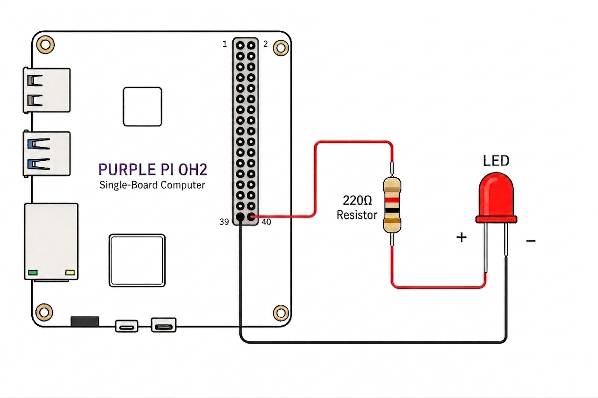

# 💡 GPIO Usage

<span class="badge badge-blue">Purple Pi OH2</span>&nbsp;
<span class="badge badge-blue">DI-DO</span>&nbsp;
<span class="badge badge-blue">I2C</span>&nbsp;
<span class="badge badge-blue">SPI</span>&nbsp;
<span class="badge badge-orange">Python · gpiod</span>

> Control a GPIO pin from Python to switch an LED on and off — a practical starting point for any digital output application (relays, buzzers, indicators).

---

## Connect via SSH (VS Code)

1. Install the **Remote - SSH** extension in VS Code
2. Press `F1` → **Remote-SSH: Connect to Host**
3. Enter: `ssh industio@<your_device_ip>`

---

## GPIO Map

| Pin # | Function     | Description / Alternate Functions           | Voltage / Type | Device Node / Notes        |
|------:|-------------|--------------------------------------------|----------------|----------------------------|
| 1     | 3.3V        | Power supply output                        | 3.3V DC        | Power output               |
| 2     | 5V          | Power supply output                        | 5V DC          | Power output               |
| 3     | I2C4_SDA    | I2C4 data signal                           | 3.3V logic     | /dev/i2c-4                 |
| 4     | 5V          | Power supply output                        | 5V DC          | Power output               |
| 5     | I2C4_SCL    | I2C4 clock signal                          | 3.3V logic     | /dev/i2c-4                 |
| 6     | GND         | Ground                                     | 0V             | Reference ground           |
| 7     | GPIO76      | GPIO2_B4 - General purpose I/O             | 3.3V logic     | gpiochip2 offset 12        |
| 8     | UART7_TX    | UART7 transmit data                        | TTL 3.3V       | /dev/ttyS7                 |
| 9     | GND         | Ground                                     | 0V             | Reference ground           |
| 10    | UART7_RX    | UART7 receive data                         | TTL 3.3V       | /dev/ttyS7                 |
| 11    | GPIO75      | GPIO2_B3 - General purpose I/O             | 3.3V logic     | gpiochip2 offset 11        |
| 12    | GPIO77      | GPIO2_B5 - General purpose I/O             | 3.3V logic     | gpiochip2 offset 13        |
| 13    | GPIO72      | GPIO2_B0 - General purpose I/O             | 3.3V logic     | gpiochip2 offset 8         |
| 14    | GND         | Ground                                     | 0V             | Reference ground           |
| 15    | GPIO73      | GPIO2_B1 - General purpose I/O             | 3.3V logic     | gpiochip2 offset 9         |
| 16    | GPIO74      | GPIO2_B2 - General purpose I/O             | 3.3V logic     | gpiochip2 offset 10        |
| 17    | 3.3V        | Power supply output                        | 3.3V DC        | Power output               |
| 18    | GPIO136     | GPIO4_B0 - General purpose I/O             | 3.3V logic     | gpiochip4 offset 8         |
| 19    | SPI0_MOSI   | SPI0 master output, slave input            | 3.3V logic     | /dev/spidev0.0             |
| 20    | GND         | Ground                                     | 0V             | Reference ground           |
| 21    | SPI0_MISO   | SPI0 master input, slave output            | 3.3V logic     | /dev/spidev0.0             |
| 22    | GPIO137     | GPIO4_B1 - General purpose I/O             | 3.3V logic     | gpiochip4 offset 9         |
| 23    | SPI0_SCLK   | SPI0 serial clock                          | 3.3V logic     | /dev/spidev0.0             |
| 24    | SPI0_CS0    | SPI0 chip select 0                         | 3.3V logic     | /dev/spidev0.0             |
| 25    | GND         | Ground                                     | 0V             | Reference ground           |
| 26    | SPI0_CS1    | SPI0 chip select 1                         | 3.3V logic     | /dev/spidev0.1             |
| 27    | I2C7_SDA    | I2C7 data signal                           | 3.3V logic     | /dev/i2c-7                 |
| 28    | I2C7_SCL    | I2C7 clock signal                          | 3.3V logic     | /dev/i2c-7                 |
| 29    | GPIO56      | GPIO1_D0 - General purpose I/O             | 3.3V logic     | gpiochip1 offset 24        |
| 30    | GND         | Ground                                     | 0V             | Reference ground           |
| 31    | GPIO57      | GPIO1_D1 - General purpose I/O             | 3.3V logic     | gpiochip1 offset 25        |
| 32    | GPIO132     | GPIO4_A4 - General purpose I/O             | 3.3V logic     | gpiochip4 offset 4         |
| 33    | GPIO58      | GPIO1_D2 - General purpose I/O             | 3.3V logic     | gpiochip1 offset 26        |
| 34    | GND         | Ground                                     | 0V             | Reference ground           |
| 35    | GPIO59      | GPIO1_D3 - General purpose I/O             | 3.3V logic     | gpiochip1 offset 27        |
| 36    | GPIO134     | GPIO4_A6 - General purpose I/O             | 3.3V logic     | gpiochip4 offset 6         |
| 37    | POWER_KEY   | Power key input (system power control)     | 3.3V logic     | /dev/input/event0          |
| 38    | GPIO98      | GPIO3_A2 - General purpose I/O             | 3.3V logic     | gpiochip3 offset 2         |
| 39    | GND         | Ground                                     | 0V             | Reference ground           |
| 40    | GPIO99      | GPIO3_A3 - General purpose I/O             | 3.3V logic     | gpiochip3 offset 3         |


## Project Setup

=== "Create folder & virtual environment"

    ```bash
    mkdir my_project && cd my_project

    sudo apt update
    sudo apt install python3-venv python3-libgpiod libgpiod-dev gpiod -y

    python3 -m venv venv
    source venv/bin/activate
    ```

    Your prompt should change to:
    ```
    (venv) industio@device:~/my_project$
    ```

=== "Create the script file"

    ```bash
    touch led_controller.py
    ```

---
## Digital Output 

### Hardware Wiring



```
Pin 40 (GPIO3_A3)  →  [220Ω resistor]  →  LED (+)
GND (Pin 39)       →  LED (–)
```

!!! warning "Always use a resistor"
    A 220Ω resistor protects both the LED and the GPIO pin from overcurrent. Skipping it can permanently damage the pin.

---

### Install gpiod

First, install the required gpiod package:

```bash
pip install gpiod
```

---

### Set GPIO Permissions

Grant permissions to access GPIO devices:

```bash
sudo chmod 666 /dev/gpiochip*
```

---

### LED Control Scripts

=== "Single blink - digital_output.py"

    ```python
    #!/usr/bin/env python3
    """
    Simple LED On/Off for Purple Pi OH2
    Using /dev/gpiochip3, line 3
    """

    import gpiod
    import time
    from gpiod.line import Direction, Value

    # Your specific GPIO pin
    CHIP = '/dev/gpiochip3'
    LINE = 3

    def led_on():
        """Turn LED on"""
        with gpiod.request_lines(
            CHIP,
            consumer="led_control",
            config={
                LINE: gpiod.LineSettings(
                    direction=Direction.OUTPUT,
                    output_value=Value.ACTIVE,
                )
            },
        ) as request:
            request.set_value(LINE, Value.ACTIVE)
            print("LED is ON")

    def led_off():
        """Turn LED off"""
        with gpiod.request_lines(
            CHIP,
            consumer="led_control",
            config={
                LINE: gpiod.LineSettings(
                    direction=Direction.OUTPUT,
                    output_value=Value.INACTIVE,
                )
            },
        ) as request:
            request.set_value(LINE, Value.INACTIVE)
            print("LED is OFF")

    def main():
        print("Simple LED Controller - GPIO3 Line 3\n")
        
        # Turn LED on
        led_on()
        
        # Wait 2 seconds
        time.sleep(2)
        
        # Turn LED off
        led_off()

    if __name__ == "__main__":
        main()
    ```

=== "Continuous blink - blink.py"

    ```python
    #!/usr/bin/env python3
    """
    Continuous LED Blinking for Purple Pi OH2
    Using /dev/gpiochip3, line 3
    Press Ctrl+C to stop
    """

    import gpiod
    import time
    import signal
    import sys
    from gpiod.line import Direction, Value

    # Your specific GPIO pin
    CHIP = '/dev/gpiochip3'
    LINE = 3

    # Global variable to control blinking
    blinking = True

    def signal_handler(sig, frame):
        """Handle Ctrl+C gracefully"""
        global blinking
        print("\n\nStopping blinking...")
        blinking = False
        # Turn LED off before exiting
        try:
            with gpiod.request_lines(
                CHIP,
                consumer="led_control",
                config={
                    LINE: gpiod.LineSettings(
                        direction=Direction.OUTPUT,
                        output_value=Value.INACTIVE,
                    )
                },
            ) as request:
                request.set_value(LINE, Value.INACTIVE)
                print("LED turned off")
        except:
            pass
        sys.exit(0)

    def continuous_blink(interval=0.5):
        """Blink LED continuously until Ctrl+C is pressed"""
        global blinking
        
        # Register signal handler for Ctrl+C
        signal.signal(signal.SIGINT, signal_handler)
        
        print("Continuous Blinking Mode - GPIO3 Line 3")
        print("Press Ctrl+C to stop\n")
        
        try:
            with gpiod.request_lines(
                CHIP,
                consumer="led_blink",
                config={
                    LINE: gpiod.LineSettings(
                        direction=Direction.OUTPUT,
                        output_value=Value.INACTIVE,
                    )
                },
            ) as request:
                
                while blinking:
                    # LED ON
                    request.set_value(LINE, Value.ACTIVE)
                    print("LED ON")
                    time.sleep(interval)
                    
                    # LED OFF
                    request.set_value(LINE, Value.INACTIVE)
                    print("LED OFF")
                    time.sleep(interval)
                    
        except Exception as e:
            print(f"Error: {e}")

    def main():
        # Start continuous blinking with 0.5 second intervals
        continuous_blink(interval=0.5)
        
        # Keep the program running
        while True:
            time.sleep(0.1)

    if __name__ == "__main__":
        main()
    ```

---

### Run the Script

!!! warning "Permissions required"
    GPIO access requires proper permissions. Make sure you've run the permission command above.

```bash
python3 digital_output.py
```

Or for continuous blinking:

```bash
python3 blink.py
```

Stop the blink loop at any time with `Ctrl + C`.

---

### Manual GPIO Testing (no Python)

Useful for quickly verifying your wiring before running a script:

```bash
gpioinfo                    # List all chips and offsets
gpioset gpiochip3 3=1       # Pin 40 HIGH → LED on
gpioset gpiochip3 3=0       # Pin 40 LOW  → LED off
gpioget gpiochip3 3         # Read current state
```

---

## Digital Input

### Input Monitor Script

Use this code for GPIO input state change detection on Purple Pi OH2:

```python
#!/usr/bin/env python3
"""
Simple GPIO Input with State Change Detection for Purple Pi OH2
Using /dev/gpiochip2, line 12
Press Ctrl+C to stop
"""

import gpiod
import time
from gpiod.line import Direction, Value, Bias, Edge

# Your specific GPIO input pin
CHIP = '/dev/gpiochip2'
LINE = 12

def detect_state_changes():
    """Detect and report state changes on GPIO input"""
    print(f"Monitoring GPIO input on {CHIP}, line {LINE}")
    print("Press Ctrl+C to stop\n")
    
    # Configure the GPIO line as input with pull-down
    config = {
        LINE: gpiod.LineSettings(
            direction=Direction.INPUT,
            bias=Bias.PULL_DOWN,  # Pull-down: LOW when nothing connected
            edge_detection=Edge.BOTH,  # Detect both rising and falling edges
        )
    }
    
    try:
        with gpiod.request_lines(
            CHIP,
            consumer="input_monitor",
            config=config,
        ) as request:
            
            previous_state = None
            
            while True:
                # Read current value
                current_value = request.get_value(LINE)
                
                # Check for state change
                if previous_state is not None and current_value != previous_state:
                    if current_value == Value.ACTIVE:
                        print("🔘 HIGH (Button PRESSED or signal HIGH)")
                    else:
                        print("🔘 LOW (Button RELEASED or signal LOW)")
                
                previous_state = current_value
                
                # Small delay to prevent CPU overuse
                time.sleep(0.01)
                
    except KeyboardInterrupt:
        print("\n\nMonitoring stopped")
    except Exception as e:
        print(f"Error: {e}")

def main():
    print("=" * 50)
    print("GPIO Input State Change Detector")
    print("=" * 50)
    detect_state_changes()

if __name__ == "__main__":
    main()
```

### Run the Script

Make sure GPIO permissions are granted before running the script:

```bash
sudo chmod 666 /dev/gpiochip*
python3 digital_input.py
```

---

## I2C OLED (SSD1306) Complete Guide

!!! warning "Disconnect power first"
    Remove power before connecting the SSD1306 OLED Display to avoid damaging the device.

---

###  Overview

This guide covers:

* Detecting I2C devices
* Communicating via Python
* Displaying text on OLED
* Rendering images + custom graphics

---

### Wiring (SSD1306 OLED)

| OLED Pin | Purple Pi |
| -------- | --------- |
| VCC      | 3.3V      |
| GND      | GND       |
| SDA      | Pin 3     |
| SCL      | Pin 5     |

#### Interpretation

| Item           | Value        |
| -------------- | ------------ |
| I2C Bus        | `/dev/i2c-4` |
| Device Address | `0x3C`       |
| Device Type    | SSD1306 OLED |

---

### Detect I2C Bus

#### List available I2C buses:

```bash
ls /dev/i2c-*
```

**Example output:**

```
/dev/i2c-0 ... /dev/i2c-7
```

---

### Scan for I2C Devices

!!! warning "Root permission required"
    Scanning I2C buses requires sudo access.

```bash
sudo i2cdetect -y 4
```

**Output:**

```
     0  1  2  3  4  5  6  7  8  9  a  b  c  d  e  f
00:                         -- -- -- -- -- -- -- -- 
10: -- -- -- -- -- -- -- -- -- -- -- -- -- -- -- -- 
20: -- -- -- -- -- -- -- -- -- -- -- -- -- -- -- -- 
30: -- -- -- -- -- -- -- -- -- -- 3c -- -- -- 
40: -- -- -- -- -- -- -- -- -- -- -- -- -- -- -- -- 
50: -- -- -- -- -- -- -- -- -- -- -- -- -- -- -- -- 
60: -- -- -- -- -- -- -- -- -- -- -- -- -- -- -- -- 
70: -- -- -- -- -- -- -- -- 
```

**Device found at:**

```
0x3C
```

---

### Install Required Packages

```bash
sudo apt update
sudo apt install i2c-tools -y
pip install python-periphery pillow
```

---

### Set I2C Permissions

Grant permissions to access I2C devices before running scripts:

```bash
sudo chmod 666 /dev/i2c-4
```

---

### Basic I2C Test

Create the `i2c_test.py` script:

```python
from periphery import I2C
import time

# Purple Pi OH2 Configuration
I2C_BUS = "/dev/i2c-4"  # Confirmed by your i2cdetect output
I2C_ADDR = 0x3C         # Confirmed by your scan

def main():
    try:
        # Open I2C connection
        i2c = I2C(I2C_BUS)
        print(f"Connected to {I2C_BUS}, device at {hex(I2C_ADDR)}")

        # SSD1306 Initialization Sequence
        init_sequence = [
            0xAE,  # Display off
            0x00, 0x10, 0x40, 0xB0, 0x81, 0xCF, 0xA1, 0xA6,
            0xA8, 0x3F, 0xC8, 0xD3, 0x00, 0xD5, 0x80, 0xD9,
            0xF1, 0xDA, 0x12, 0xDB, 0x40, 0x8D, 0x14, 0xAF  # Display on
        ]

        # Send initialization commands
        for cmd in init_sequence:
            i2c.transfer(I2C_ADDR, [I2C.Message([0x00, cmd])])
        time.sleep(0.1)

        # Clear display function
        def clear_display():
            for page in range(8):
                # Set page address
                i2c.transfer(I2C_ADDR, [I2C.Message([0x00, 0xB0 + page])])
                # Set column address
                i2c.transfer(I2C_ADDR, [I2C.Message([0x00, 0x00])])
                i2c.transfer(I2C_ADDR, [I2C.Message([0x00, 0x10])])
                # Write zeros to all columns
                for _ in range(128):
                    i2c.transfer(I2C_ADDR, [I2C.Message([0x40, 0x00])])

        clear_display()

        # Simple 5x7 font
        font = {
            'H': [0x7F, 0x08, 0x08, 0x08, 0x7F],
            'e': [0x38, 0x54, 0x54, 0x54, 0x18],
            'l': [0x00, 0x41, 0x7F, 0x40, 0x00],
            'o': [0x38, 0x44, 0x44, 0x44, 0x38],
            ' ': [0x00, 0x00, 0x00, 0x00, 0x00],
        }
        
        text = "Hello"

        # Position at page 1
        i2c.transfer(I2C_ADDR, [I2C.Message([0x00, 0xB1])])
        # Set column to 0
        i2c.transfer(I2C_ADDR, [I2C.Message([0x00, 0x00])])
        i2c.transfer(I2C_ADDR, [I2C.Message([0x00, 0x10])])

        # Write each character
        for char in text:
            char_data = font.get(char, [0x00]*5)
            for col in char_data:
                i2c.transfer(I2C_ADDR, [I2C.Message([0x40, col])])
            # Space between characters
            i2c.transfer(I2C_ADDR, [I2C.Message([0x40, 0x00])])

        print("Text sent successfully!")
        i2c.close()

    except Exception as e:
        print(f"Error: {e}")
        print("\nTroubleshooting:")
        print("1. Make sure you're using sudo: sudo python3 i2c_test.py")
        print("2. Check wiring: SDA=Pin3, SCL=Pin5, VCC=Pin1(3.3V), GND=Pin9")

if __name__ == "__main__":
    main()
```

#### Run the Test:

```bash
python3 i2c_test.py
```

**Expected Output:**

```
Connected to /dev/i2c-4, device at 0x3c
Text sent successfully!
```

---

## Display Image (Bitmap)

### Generate Bitmap

First, create a bitmap from your image. Place your graphics file in the project directory, then create `converter.py`:

```python
from PIL import Image

# Load image - replace with yours
img = Image.open("elephant.png").convert("L") 

# Resize smaller (leave space for text)
img = img.resize((128, 48))

# Convert to black/white
img = img.point(lambda x: 0 if x < 128 else 255, '1')

# Create empty OLED buffer
buffer = [0x00] * (128 * 8)

pixels = img.load()

# Center vertically (top area)
y_offset = 0   # top aligned (can change to center if you want)

for x in range(128):
    for y in range(48):
        if pixels[x, y] == 0:
            oled_y = y + y_offset
            page = oled_y // 8
            index = x + (page * 128)
            buffer[index] |= (1 << (oled_y % 8))

# Save buffer
with open("elephant_bitmap.py", "w") as f:
    f.write("elephant_bitmap = [\n")
    for i in range(0, len(buffer), 16):
        line = ", ".join(f"0x{b:02X}" for b in buffer[i:i+16])
        f.write(f"    {line},\n")
    f.write("]\n")

print("Smaller elephant bitmap generated!")
```

#### Run the Converter:

```bash
python3 converter.py
```

**Output:** `elephant_bitmap.py` file is created

---

### Create `oled_image.py`

This script displays the image with text. Adjust positioning and text as needed:

```python
from periphery import I2C
from elephant_bitmap import elephant_bitmap

I2C_BUS = "/dev/i2c-4"
I2C_ADDR = 0x3C

i2c = I2C(I2C_BUS)

def send_cmd(cmd):
    i2c.transfer(I2C_ADDR, [I2C.Message([0x00, cmd])])

def send_data(data):
    i2c.transfer(I2C_ADDR, [I2C.Message([0x40] + data)])

# -------- INIT --------
def init_display():
    cmds = [
        0xAE, 0x20, 0x00, 0xB0, 0xC8, 0x00, 0x10,
        0x40, 0x81, 0xFF, 0xA1, 0xA6, 0xA8, 0x3F,
        0xA4, 0xD3, 0x00, 0xD5, 0xF0, 0xD9, 0x22,
        0xDA, 0x12, 0xDB, 0x20, 0x8D, 0x14, 0xAF
    ]
    for c in cmds:
        send_cmd(c)

# -------- TEXT DRAW --------
def draw_centered_text_on_buffer(buffer, text):
    font = {
        'E':[0x7F,0x49,0x49,0x49,0x41],
        'l':[0x00,0x41,0x7F,0x40,0x00],
        'e':[0x38,0x54,0x54,0x54,0x18],
        'p':[0x7C,0x14,0x14,0x14,0x08],
        'h':[0x7F,0x08,0x08,0x08,0x70],
        'a':[0x20,0x54,0x54,0x54,0x78],
        'n':[0x7C,0x08,0x04,0x04,0x78],
        't':[0x04,0x3F,0x44,0x40,0x20],
        'r':[0x7C,0x08,0x04,0x04,0x08],
        'o':[0x38,0x44,0x44,0x44,0x38],
        'i':[0x00,0x44,0x7D,0x40,0x00],
        'c':[0x38,0x44,0x44,0x44,0x20],
        's':[0x48,0x54,0x54,0x54,0x20],
    }

    char_width = 6
    text_width = len(text) * char_width
    start_x = (128 - text_width) // 2

    page = 7  # bottom page

    for i, char in enumerate(text):
        char_data = font.get(char, [0x00]*5)

        for col in range(5):
            x = start_x + i * char_width + col
            if 0 <= x < 128:
                index = x + (page * 128)
                buffer[index] = char_data[col]

        # spacing column
        x = start_x + i * char_width + 5
        if 0 <= x < 128:
            buffer[x + (page * 128)] = 0x00

# -------- DISPLAY --------
def display_image(buffer):
    for page in range(8):
        send_cmd(0xB0 + page)
        send_cmd(0x00)
        send_cmd(0x10)
        start = page * 128
        send_data(buffer[start:start+128])

# -------- MAIN --------
try:
    init_display()

    # Copy original buffer (important!)
    buffer = elephant_bitmap.copy()

    # Add centered text
    draw_centered_text_on_buffer(buffer, "Elephantronics")

    # Display final image
    display_image(buffer)

    print("🐘 Elephant + Elephantronics displayed!")

except Exception as e:
    print("Error:", e)

finally:
    i2c.close()
```

#### Run Image Display:

```bash
python3 oled_image.py
```

---

## UART

!!! warning "Connect pins first"
    Connect GPIO 8 (TX) and GPIO 10 (RX) together for loopback testing.

---

### Overview

This guide covers:

* Testing UART with microcom
* Python serial communication
* Loopback test example

---

### Wiring (Loopback Test)

| Pin # | Function  | Connection |
|------:|----------|------------|
| 8     | UART7_TX | Connect to Pin 10 |
| 10    | UART7_RX | Connect to Pin 8  |

#### Interpretation

| Item       | Value        |
| ---------- | ------------ |
| UART Port  | `/dev/ttyS7` |
| Baud Rate  | 115200       |
| Device     | UART7        |

---

### Install Required Packages

```bash
sudo apt update
sudo apt install microcom python3-serial -y
```


---

### Test with microcom

!!! warning "Root permission required"
    UART access requires sudo.

```bash
sudo microcom -s 115200 -p /dev/ttyS7
```

**Expected behavior:** Type characters - you should see them echoed back immediately.

Press `Ctrl + X` to exit.

---

### Prepare Python UART Access

To run the Python loopback test without `sudo`, add your user to the `dialout` group and restart your session:

```bash
sudo usermod -a -G dialout $USER
```

After running this, log out and log back in. Close all VS Code SSH terminals, then open a fresh SSH session, activate the virtual environment, and run the test code.

---

### Python Loopback Test

Activate your Python virtual environment and install `pyserial`:

```bash
pip install pyserial
```

Create `loopback_test.py`:

```python
import serial
import time

# Configuration for Purple Pi OH2 UART7
UART_PORT = "/dev/ttyS7"
BAUD_RATE = 115200

try:
    # Initialize serial port
    ser = serial.Serial(
        port=UART_PORT,
        baudrate=BAUD_RATE,
        bytesize=serial.EIGHTBITS,
        parity=serial.PARITY_NONE,
        stopbits=serial.STOPBITS_ONE,
        timeout=1
    )

    print(f"UART opened: {UART_PORT} @ {BAUD_RATE} baud")
    print("Starting loopback test. Ensure TX (Pin 8) and RX (Pin 10) are connected.")
    print("-" * 50)

    counter = 0
    while True:
        # Construct and send a test message
        message = f"Purple Pi OH2 Test #{counter}\n"
        ser.write(message.encode())
        print(f"Sent: {message.strip()}")

        # Wait briefly for the echo
        time.sleep(0.1)

        # Check for received data
        if ser.in_waiting:
            response = ser.readline().decode(errors="ignore").strip()
            if response:
                print(f"Received: {response}")
                if response == message.strip():
                    print("--> Loopback SUCCESS!")
                else:
                    print("--> WARNING: Mismatch in sent/received data.")
            else:
                print("--> No data received (loopback failed).")
        else:
            print("--> No data in buffer (loopback failed).")

        counter += 1
        time.sleep(2) # Wait 2 seconds before next iteration

except KeyboardInterrupt:
    print("\nTest stopped by user.")
except serial.SerialException as e:
    print(f"Serial error: {e}")
    print("Did you remember to connect Pin 8 to Pin 10?")
finally:
    if 'ser' in locals() and ser.is_open:
        ser.close()
        print("UART port closed.")
```

#### Run the Script


```bash
python3 loopback_test.py
```

Stop the test at any time with `Ctrl + C`.